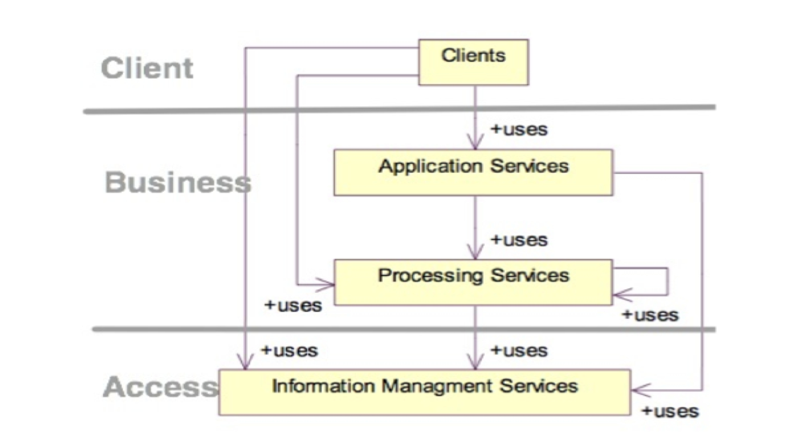
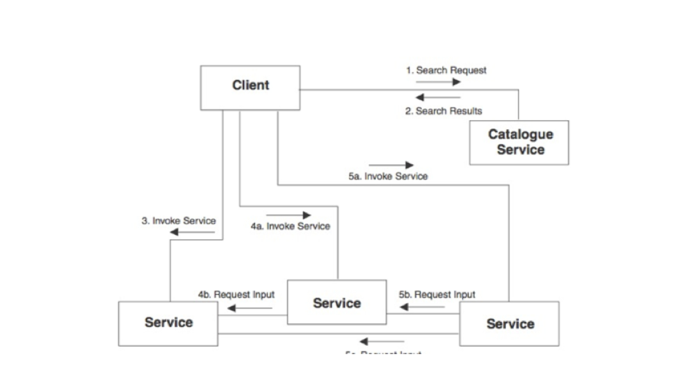
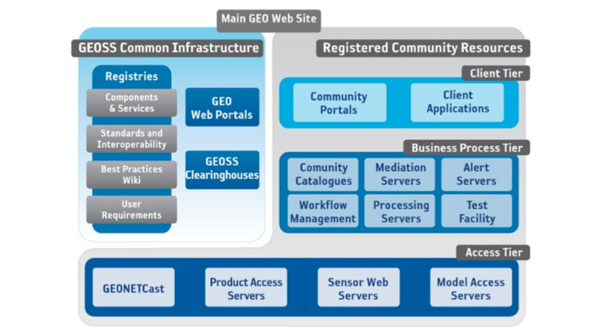
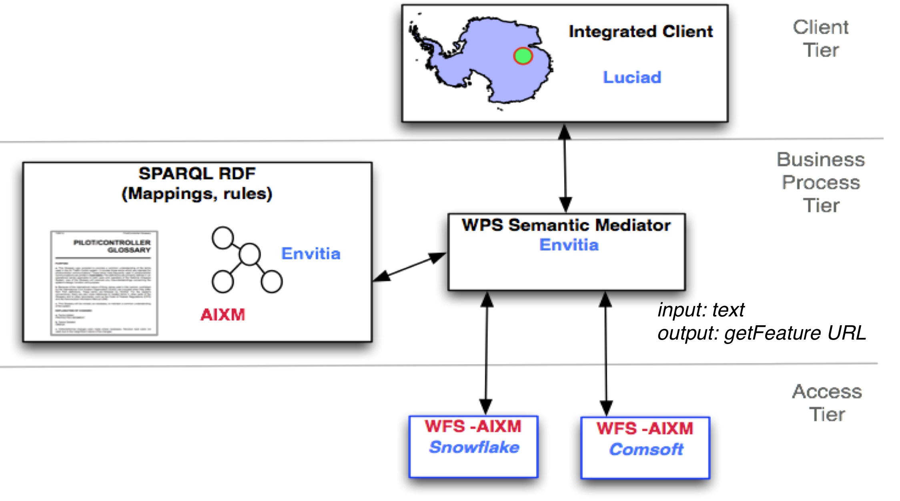
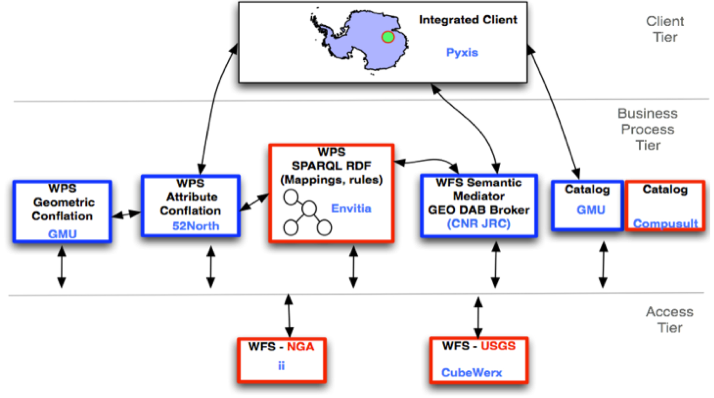

Geospatial Architectures
========================

Computing Architecture
----------------------

RM-ODP: Different views of the organization of a computing system: Enterprise, Information, computing, engineering, Technology.

Computing Architecture
----------------------
WIKIPEDIA: A system architecture or systems architecture is the conceptual design that defines the structure and/or behavior of a system. An architecture description is a formal description of a system, organized in a way that supports reasoning about the structural properties of the system. It defines the system components or building blocks and provides a plan from which products can be procured, and systems developed, that will work together to implement the overall system. 

Principles of an Architecture
-----------------------------

- Comprehensive framework for developers
- Covers access and process
- Allow variety of sources
- Allow generic computer interfaces
- Within an open information technology environment

Service Oriented Architecture
-----------------------------
(Wikipedia) SOA: computer systems architectural style for creating and using business processes, packaged as services, throughout their lifecycle.

Service Oriented Architectures
------------------------------

.. image:: ../img/soa.jpg
      :height: 800
      :width: 1200  
      
Service Tiers
-------------

      
Chaining
--------

      
Multitier Architectures
-----------------------

 
Mediate between heterogeneous sources
-------------------------------------
- Pilots want to search data using terms from a well know glossary
- Data is in WFS (AIXM)
      
3 Tier Architectures
--------------------

      
Conflate between heterogeneous models
-------------------------------------
- Two data sources
- Different models
- One has well know styles associated to its features
- Want to complemented missing data

3 Tier Architecture for Conflation
----------------------------------

      

Aviation SAA Pilot
------------------

.. image:: ../img/aviationPilotArch.jpg
      :height: 1000
      :width: 1400  

Designing - RM ODP
------------------

.. image:: ../img/rmodp.jpg
      :height: 800
      :width: 1200  
      
      
Enterprise Viewpoint
--------------------
- stake holders viewpoint
- why the effort in being undertaken
- scope
- objectives
- **defined by: Use Cases**

Enterprise Viewpoint Example
----------------------------

Problem:
   Pilots have difficulties querying aviation data
   Data uses different terminology to what they are used to.

Solution:
   Develop a system that allows querying of Aviation data through user  terminology from a Pilots’ Glossary

Example use case:
   User search for data using Pilot Glossary

Information Viewpoint
---------------------
- Conceptual models for
   - Data
   - Metadata

- Defines Encoding, For example:
   - WaterML
   - GML
   - SensorML

Information Viewpoint Example
-----------------------------

AIXM in GML 
   for Aviation Data

Air Transportation Ontology in OWL 
   for Pilot Glossary terms

AIXM ontology in OWL 
   to represent Feature Types in AIXM

Computational Viewpoint
-----------------------

Interfaces among service consumers and providers. For example:

   - WFS
   - WMS
   - SOS
   - WCS
   - CSW
   - WPS
   - etc..
   
Computational Viewpoint Example
-------------------------------
  
   
WFS (AIXM)
   to provide aviation data

GeoSPARQL 
   to provide ontologies (including mappings)

Engineering Viewpoint
---------------------

- Describes Architecture. Which components are needed?
- Explains how services related to each other.
- Services are linked via the interfaces listed in the computational viewpoint.

Engineering Viewpoint Example
-----------------------------

Other References
----------------

- `OGC 08-062r7  - OGC Reference Model (2.1).  <https://portal.opengeospatial.org/files/?artifact_id=47245>`_
- `OGC  02-112 -  Topic 12 - The OpenGIS Service Architecture <http://portal.opengeospatial.org/files/?artifact_id=1221>`_
- `OGC 07-097 - Reference Model for the ORCHESTRA Architecture  <http://portal.opengeospatial.org/files/?artifact_id=23286>`_
- `OGC 10-028r1 - GIGAS Methodology for comparative analysis of information and data management systems <http://portal.opengeospatial.org/files/?artifact_id=39475>`_
- `OGC 11-013r6 - OGC Engineering Report: Water Information Services Concept Development Study  <http://portal.opengeospatial.org/files/?artifact_id=44834>`_
- `OGC 11-055 - OGC SAA Pilot Study Engineering Report      <https://portal.opengeospatial.org/files/?artifact_id=44939>`_
