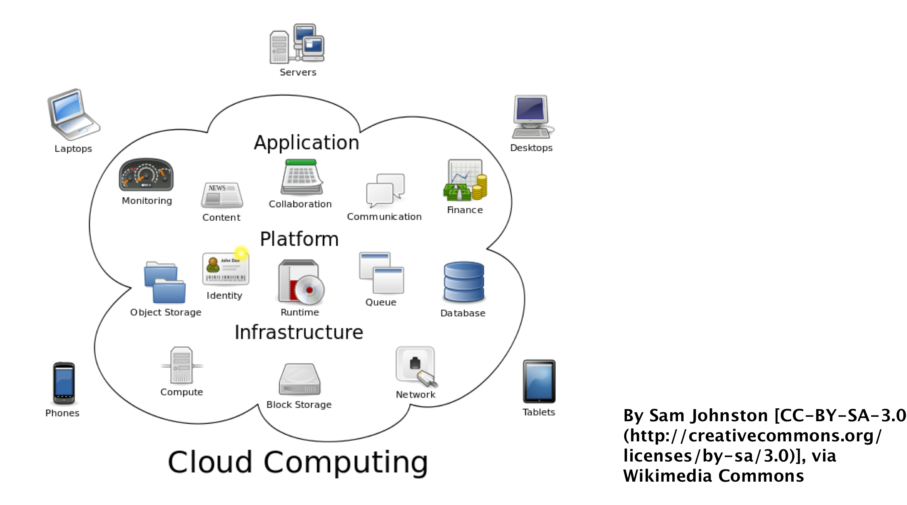
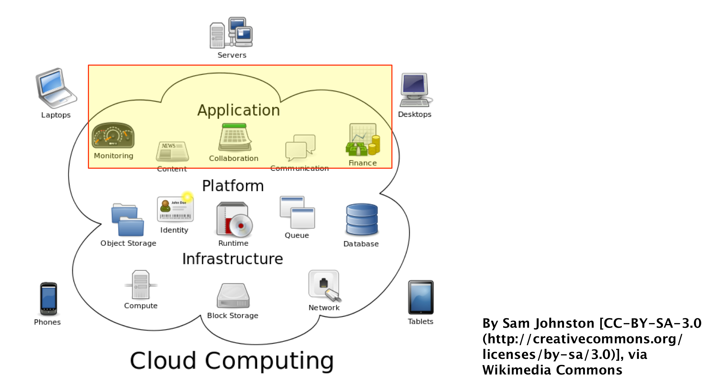
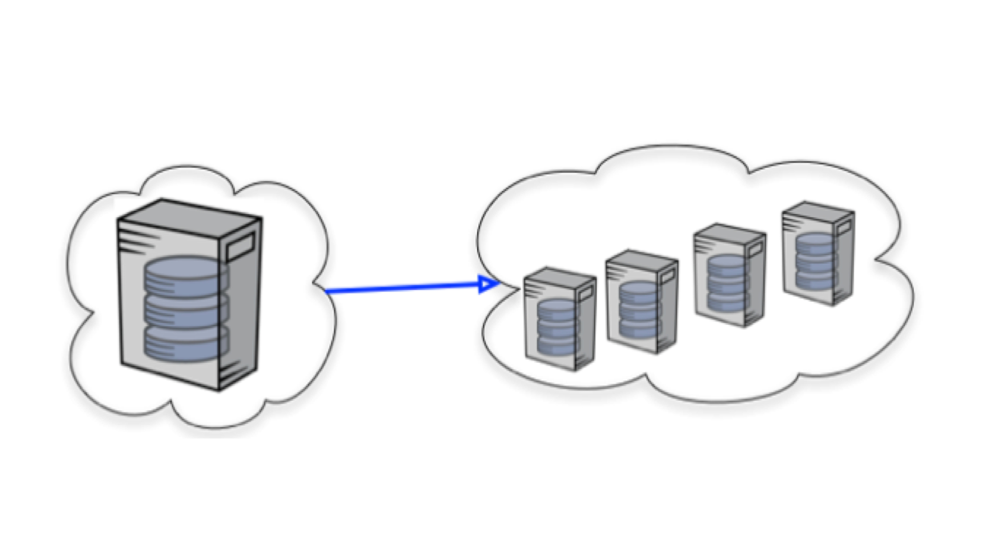
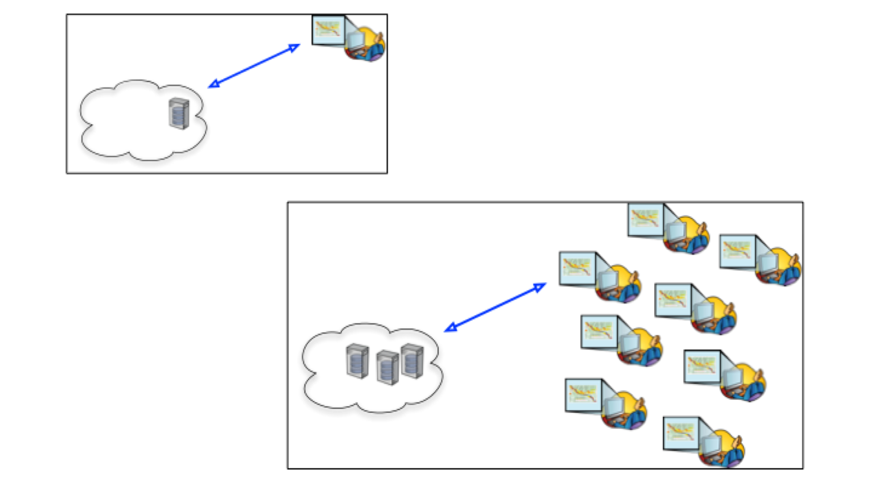
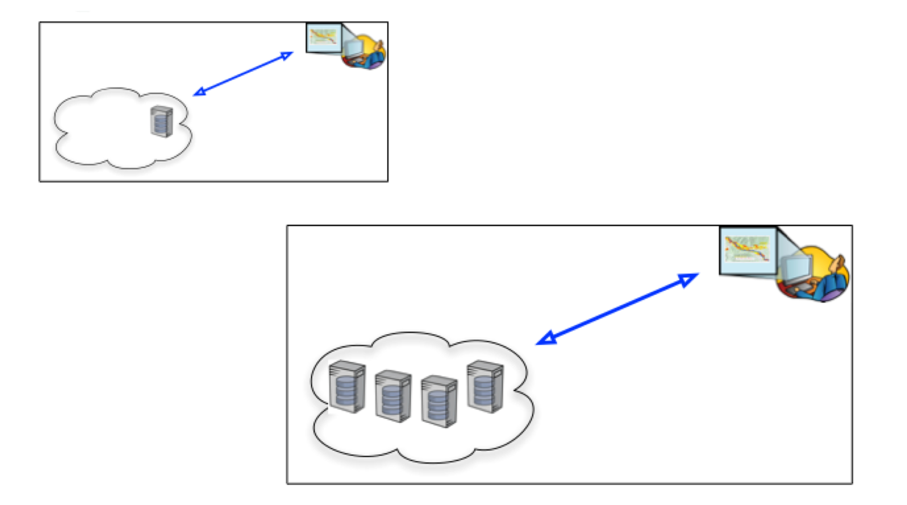
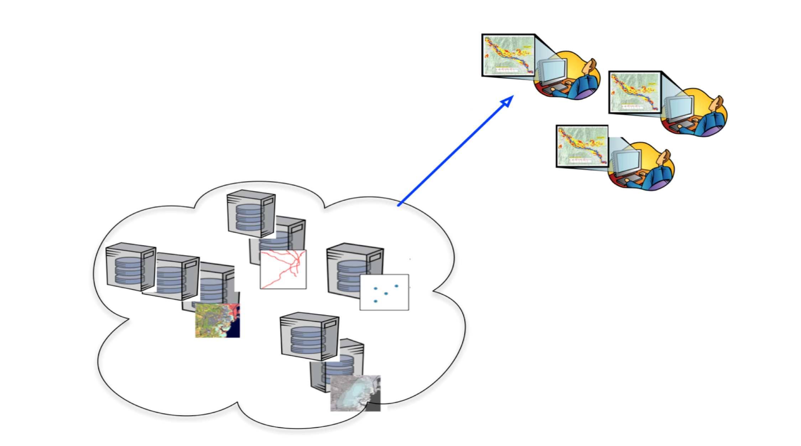
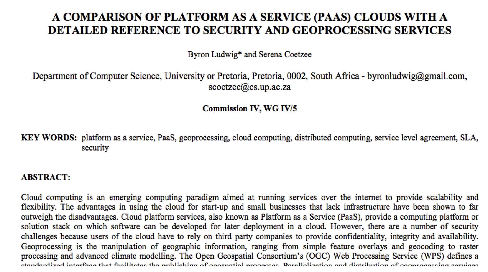
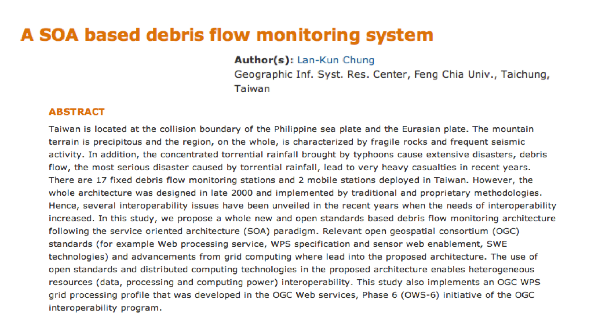
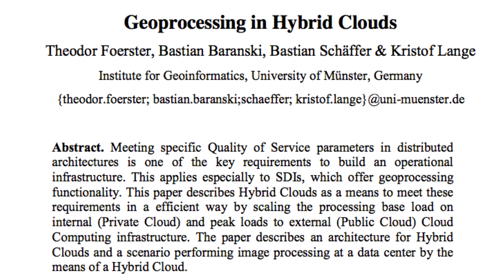
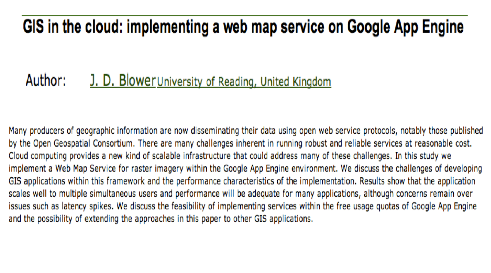

Cloud Computing
===============

Trend
-----

.. image:: ../img/cloud-trend.jpg
      :height: 800
      :width: 1200 
      
Cloud Computing
---------------

            
Software as a Service
---------------------

      
Scalability
-----------

      

      
Multiple Requests
-----------------

      
Process Intensive
-----------------

      
OGC Services in the Cloud
-------------------------

      

Comparison Platform as Services
-------------------------------

      

Monitoring Based Grid Computing
-------------------------------

      
Geoprocessing in Hybrid Clouds
------------------------------

      
WMS in Google App Engine
------------------------

      

      
                             