 .. class:: table.noborder

+------------------------------------------+-------------------------------------------+
| .. image:: ../extras/img/ogc-logo.jpg    | .. image:: ../extras/img/meeting-logo.jpg | 
|        :height: 300                      |        :height: 300                       |
|        :width: 500                       |        :width: 500                        |
+------------------------------------------+-------------------------------------------+
        
| Tutorial OGC Services

| Dr. Luis Bermudez
| Director Compliance, OGC
| 
| Copyright: 2013, Open Geospatial Consortium

Geospatial Architectures
===================================

Service Oriented Architectures
-------------------------------

.. image:: ../arch/img/soa.jpg
      :height: 800
      :width: 1000  

Complex Information Systems
============================

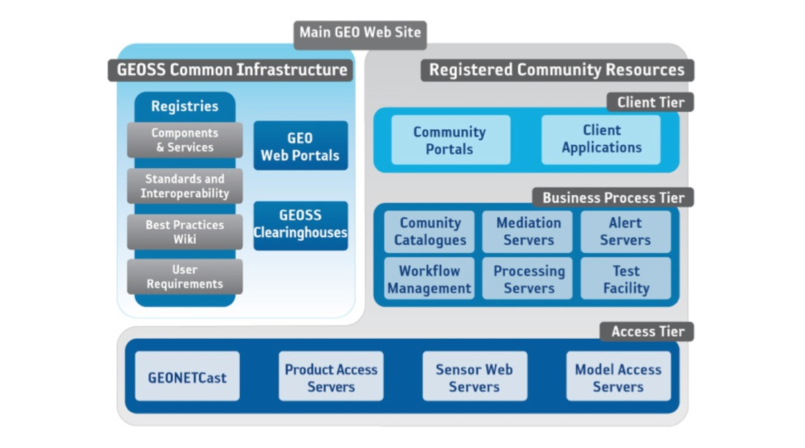

Aviation SAA Pilot
====================

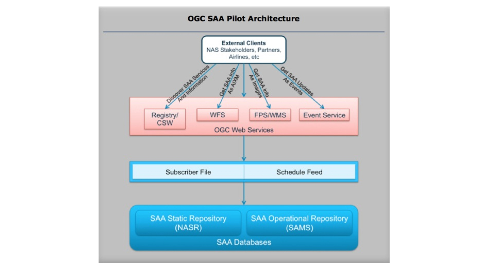

Designing - RM ODP
===================

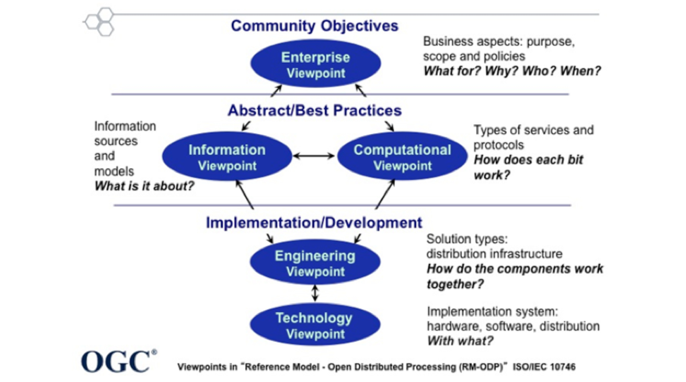
      
      
Enterprise Viewpoint
======================
- stake holders viewpoint
- why the effort in being undertaken
- scope
- objectives
- **defined by: Use Cases**

Information Viewpoint
======================
- Conceptual models for
   - Data
   - Metadata
   
- Defines Encoding, For example:
   - WaterML
   - GML
   - SensorML   

            
Computational Viewpoint
========================

Interfaces among service consumers and providers. For example:

   - WFS
   - WMS
   - SOS

Engineering Viewpoint
========================
- Describes Architecture. Which components are needed?
- Explains how services related to each other. 
- Services are linked via the interfaces listed in the computational viewpoint.

      

Other References
==================

- `OGC 08-062r7  - OGC Reference Model (2.1).  <https://portal.opengeospatial.org/files/?artifact_id=47245>`_
- `OGC  02-112 -  Topic 12 - The OpenGIS Service Architecture <http://portal.opengeospatial.org/files/?artifact_id=1221>`_
- `OGC 07-097 - Reference Model for the ORCHESTRA Architecture  <http://portal.opengeospatial.org/files/?artifact_id=23286>`_
- `OGC 10-028r1 - GIGAS Methodology for comparative analysis of information and data management systems <http://portal.opengeospatial.org/files/?artifact_id=39475>`_
- `OGC 11-013r6 - OGC Engineering Report: Water Information Services Concept Development Study  <http://portal.opengeospatial.org/files/?artifact_id=44834>`_
- `OGC 11-055 - OGC SAA Pilot Study Engineering Report      <https://portal.opengeospatial.org/files/?artifact_id=44939>`_

WEB Map Service (WMS)
==================================

This tutorial provides a practical introduction to OGC Web Map Service (WMS) 
Interface standard.

Goals
-----
- Understand what WMS can be used for
- Understand WMS requests and best practices

Web Map Service (WMS)
----------------------
The latest version of WMS is 1.3.0 [#ogc-06-042].

A WMS Server:

- Provides information about what maps a service can produce
- Produces a Map
- Answers queries about content of a Map

WMS Usage
------------
-  Produce a Map
-  Answer queries about content of the map

WMS Operations
----------------
- GetCapabilities
- GetMap
- GetFeatureInfo

WMS GetCapabilities Request
----------------------------
Request example::

   http://ri.opengeospatial.org:8680/degree-wms-130/services?
   service=WMS&
   version=1.3.0&
   request=GetCapabilities
      
`Link to getCapabilities <http://ri.opengeospatial.org:8680/degree-wms-130/services?service=WMS&version=1.3.0&request=GetCapabilities>`_

WMS GetCapabilities Response
-----------------------------

-  How to invoke GetMap 
-  Types of exceptions
-  List of layers

WMS GetMap Request
-------------------

Request example::

   http://ri.opengeospatial.org:8680/degree-wms-130/services?
   service=WMS&
   version=1.3.0&
   request=GetMap&
   format=image/png&
   width=300&
   height=300&
   crs=EPSG:4326&
   layers=cite:BasicPolygons,cite:Forests&
   STYLES=default,default
   BBOX=-2,-1,2,6&

`Link to GetMap <http://ri.opengeospatial.org:8680/degree-wms-130/services?service=WMS&version=1.3.0&request=GetMap&format=image/png&width=300&height=300&crs=EPSG:4326&layers=cite:BasicPolygons,cite:Forests&BBOX=-2,-1,2,6&STYLES=default,default>`_

WMS GetFeatureInfo Request
---------------------------

Request example::

   http://ri.opengeospatial.org:8680/degree-wms-130/services?
   service=WMS&
   version=1.3.0&
   request=getfeatureinfo&
   format=text/html&
   crs=EPSG:4326&
   layers=cite:BasicPolygons&
   query_layers=cite:BasicPolygons&
   BBOX=-2,-1,2,6&
   width=300&
   height=300&
   i=1&
   j=1
   
`Link to GetFeatureInfo <http://ri.opengeospatial.org:8680/degree-wms-130/services?service=WMS&version=1.3.0&request=getfeatureinfo&format=text/html&crs=EPSG:4326&layers=cite:BasicPolygons&query_layers=cite:BasicPolygons&BBOX=-2,-1,2,6&width=300&height=300&i=1&j=1>`_
   

Tutorial OGC Catalog
======================

- Metadata
- Search
- Catalog
- FGDC
- ISO
- Profiles
- CSW Operations
- OpenSearch

Resource
----------

- A thing
- Anything which is worth uniquely identifying (over the Web)
- Can be data

Metadata
------------

- Data about a resource
- Data about data

  
Metadata
------------
.. image:: ../cat/img/metadataaboutdata.jpg
      :height: 654
      :width: 1049

What is Missing ?
------------------
.. image:: ../cat/img/nutrition_label.jpg
      :height: 654
      :width: 1049

      
What is Missing ?
------------------

.. image:: ../cat/img/cans.jpg
      :height: 654
      :width: 1049   
      
      
Metadata - Who
---------------
- Who collected the data?
- Who processed the data?
- Who wrote the metadata?
- Who to contact for questions?
- Who to contact to order?
- Who owns the data?

Metadata - What
----------------
- What are the data about?
- What project were they collected under?
- What are the constraints on their use?
- What is the quality?
- What are appropriate uses?
- What parameters were measured?
- What format are the data in?

Metadata - Why
---------------
- Why were the data collected?

Metadata - Why
---------------
- Why were the data collected?

Where
-------

- Where were the data collected?
- Where were the data processed?
- Where are the data located?

When
-------
- When were the data collected?
- When were the data processed?

How
-----
- How were the data collected?
- How were the data processed?
- How do I access the data?
- How do I order the data?
- How much do the data cost?
- How was the quality assessed?

 
Metadata requires update
-------------------------
.. list-table::
   :widths: 50 50
   :header-rows: 1

   * - 1980
     - 2005
   * - British Honduras
     - Belize
   * - West Germany
     - Germany

Metadata Value
---------------
- Organizations: captures the knowhow of an organization  
- Developers: help share reliable information
- Users: helps discover data   
  
 
Search
-----------

Discovery & evaluation of resources through (summary) metadata

Catalog
---------
- Organized, detailed, descriptive list of items 
- arranged systematically (so they can be found)

Catalog
---------
.. image:: ../cat/img/library.jpg
      :height: 1254
      :width: 2249   
      
Catalog Service
-------------------
.. image:: ../cat/img/catalogservice.jpg
      :height: 1254
      :width: 2249   
         

Registry
-----------
**System** for maintaining a register or authoritative list of 
names / values / types / relationships (so they can be referenced)

Repository or Archive
------------------------

Place for storage of resources (so they can be retrieved)

Trader
-------------
 
- Intermediary in a service oriented architecture
- Connects providers with consumers)

Discovery using SOA 
------------------------------

.. image:: ../cat/img/soa_triangle.jpg
      :height: 930
      :width: 1800
      
Example: Geospatial Platform
-----------------------------
.. image:: ../cat/img/geoplatform.jpg
      :height: 1329
      :width: 2487
      
Metadata for Hurricane Map
-----------------------------
.. image:: ../cat/img/metadata1.jpg
      :height: 954
      :width: 1933
      
Metadata for Hurricane Map
-----------------------------
.. image:: ../cat/img/metadata2.jpg
      :height: 1045
      :width: 1608
      :scale: 70          

FGDC 
------
.. image:: ../cat/img/fgdc.jpg
      :height: 1254
      :width: 2249

ISO 19115 Geographic Information
--------------------------------------
.. image:: ../cat/img/iso1.jpg
      :height: 1254
      :width: 2249
       
ISO 19115 Geographic Information
--------------------------------------
.. image:: ../cat/img/iso2.jpg
      :height: 1254
      :width: 2249
          

Profiles
--------------------------------------
.. image:: ../cat/img/profiles.jpg
      :height: 1254
      :width: 2249 
      
Catalog Service
----------------
.. image:: ../cat/img/catalogservices.jpg
      :height: 1254
      :width: 2249     
      

      
Catalog Services
-----------------

- CSW
- ISO 19119 Metadata Profile
- Z39.50 Profile
- OASIS ebRIM Profile
- OpenSearch      
    

GEOSS Registry
----------------

.. image:: ../cat/img/geossreg.jpg
      :height: 1254
      :width: 2249  

Example Requests 
------------------

`GEOSS Geonetwork <http://geonetwork-opensource.org/stable/developers/xml_services/csw_services.html#getcapabilities>`_

    
      
CSW Operations
----------------
- GetCapabilities
- DescribeRecord
- GetRecordById
- GetRecords

CSW GetCapabilities
-------------------
Example Request:: 

    http://geossregistries.info:9002/geonetwork/srv/en/csw?
      Request=GetCapabilities&Service=CSW&Version=2.0.2

`Link to GetCapabilities <http://geossregistries.info:9002/geonetwork/srv/en/csw?Request=GetCapabilities&Service=CSW&Version=2.0.2>`_       
      
      
CSW DescribeRecord
-------------------
Example Request:: 

    http://geossregistries.info:9002/geonetwork/srv/en/csw?     
      Request=DescribeRecord&
      Service=CSW&Version=2.0.2&
      NAMESPACE=xmlns(rim=urn:oasis:names:tc:ebxml-regrep:xsd:rim:3.0)
      
`Link to DescribeRecord <http://geossregistries.info:9002/geonetwork/srv/en/csw?Request=DescribeRecord&Service=CSW&Version=2.0.2&NAMESPACE=xmlns%28rim=urn:oasis:names:tc:ebxml-regrep:xsd:rim:3.0%29>`_      

CSW GetRecordById
-------------------
Example Request::

   http://geossregistries.info:1090/GEOSSCSW202/discovery?
      Service=CSW&Request=GetRecordById&
      Id=urn:uuid:85fd419c-081b-4e69-8998-d1003b5d4489:1.4,
      urn:uuid:a9ad5a4b-1589-4876-a149-904fc5a9fef0:1.8

`Link to GetRecordById <http://geossregistries.info:9002/geonetwork/srv/en/csw?Service=CSW&Request=GetRecordById&Id=urn:uuid:85fd419c-081b-4e69-8998-d1003b5d4489:1.4,urn:uuid:a9ad5a4b-1589-4876-a149-904fc5a9fef0:1.8>`_

CSW GetRecords
----------------
Example Request::
   
   http://geossregistries.info:9002/geonetwork/srv/en/csw?
      Service=CSW&Request=GetRecords&version=2.0.2%20&
      constraintLanguage=CQL_TEXT&
      typeNames=gmd:MD_Metadata&
      namespace=xmlns%28gmd%3Dhttp%3A%2F%2Fwww.isotc211.org%2F2005%2Fgmd%29&
      resultType=results

      

OpenSearch
-----------

.. image:: ../cat/img/opensearch.jpg
      :height: 1254
      :width: 2249  

OpenSearch
-----------
.. code-block:: xml

    <?xml version="1.0" encoding="UTF-8"?>
    <OpenSearchDescription 
         xmlns="http://a9.com/-/spec/opensearch/1.1/">
      <ShortName>Mirador Dataset Search</ShortName>
      <Description>Use Mirador Dataset Search to obtain a 
      list of Earth Science Data Sets</Description>
      <Tags>Mirador Dataset Search</Tags>
      <Contact>mirador-disc@listserv.gsfc.nasa.gov</Contact>
      ...
      

OpenSearch
-----------
.. code-block:: xml

   <Url type="application/atom+xml" 
           template="http://mirador.gsfc.nasa.gov/cgi-bin/
              mirador/collectionlist.pl?
           keyword={searchTerms}&
           page=1&
           count={count}&
           osLocation={geo:box}&
           startTime={time:start}&
           endTime={time:end}&
           format=atom"/>

OpenSearchGeo
---------------
::

      http://example.com/?
      q=pizza&
      bbox=-111.032,42.943,-119.856,43.039&
      format=rss
      
OpenSearchGeo
---------------
::

     http://example.com/?
     q=pizza&
     lat=43.25&lon=-123.45
     &radius=10000&
     format=rss

    

OpenSearchGeo
---------------
::

   http://example.com/?
   q=pizza&
   l=boston&
   format=rss
   
   
Example Tool: GeoNetwork
----------------------------
.. image:: ../cat/img/geonetwork.jpg
      :height: 1254
      :width: 2249   
      
        

Credits
--------

- `NOAA NCDDC Metadata training materials <http://www.ncddc.noaa.gov>`_

SWE Introduction
=================

SWE definition
--------------

Set of OGC standards that work together to better: 

- discover
- access
- control
- use sensor data. 

SWE scope
----------

Let's call all these **Sensor Systems** or *Systems*

- Detectors
- Sensors
- Sensor Networks
- Platforms

SWE motivation
---------------

- Systems are disconnected
- Systems are heterogeneous
- Systems produce massive amount of data

Systems are disconnected
-----------------------------

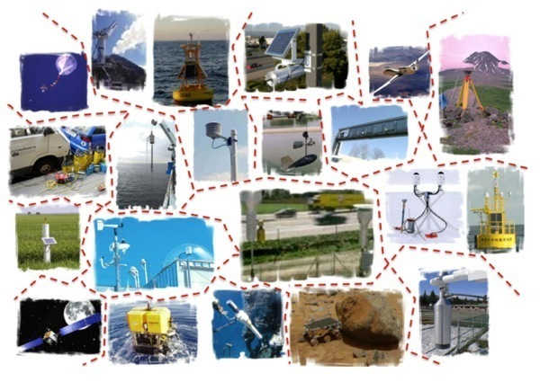

Systems are heterogeneous
-----------------------------

Systems produce lots of data
-----------------------------

 
640 terabytes of operational data on just one Atlantic crossing
      

    
User connected to sensor systems
---------------------------------

.. user connected to sensors systems to perform various kind of operations

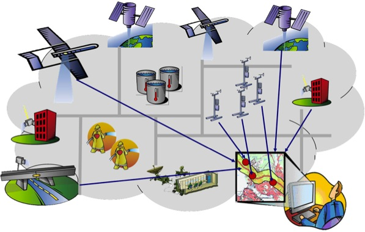
      
 
SWE requirements
-----------------------------
.. 

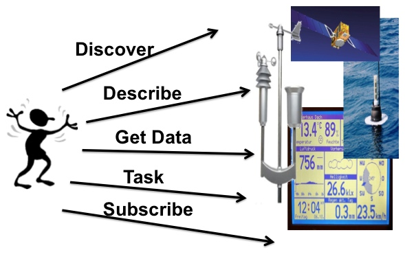
           
      
SWE solution
------------
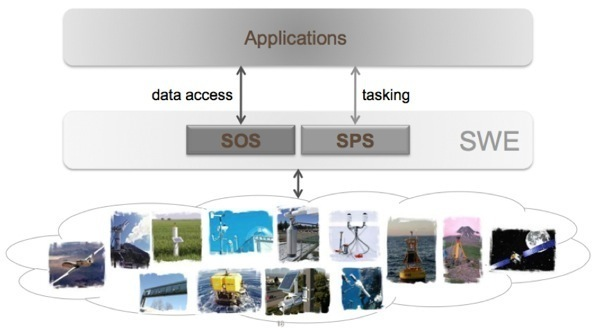
      
SWE encoding standards
----------------------

- Observations and Measurements (O&M)
- SensorML
- SWECommon
- PUCK

SWE interface standards
------------------------

- Sensor Observation Service
- Sensor Planning Service
- PUCK

SWECommon
=================

SWECommon provides
------------------

- primitive data types (boolean, categories, text, quantities ..)
- aggregate data types (records, arrays, matrices)
- specialized data types (curves, time dependent)
- Structure to encode quality information
- Structure to provide semantic annotations 

SWECommon relation with other encoding standards
------------------------------------------------

- In SensorML inputs and outputs are express via SWECommon
- In O&M the result can be expressed with SWECommon

SWECommon XML Example
-------------------------
Namespace declaration:

.. code-block:: xml
   
   <?xml version="1.0" encoding="UTF-8"?>
   <swe:DataStream id="EXAMPLE_01" 
      xmlns:swe="http://www.opengis.net/swe/2.0"
      xmlns:gml="http://www.opengis.net/gml/3.2"
      xmlns:xsi="http://www.w3.org/2001/XMLSchema-instance"
      xmlns:xlink="http://www.w3.org/1999/xlink"
      xsi:schemaLocation=
            "http://www.opengis.net/swe/2.0 http://schemas.opengis.net/sweCommon/2.0/swe.xsd">
    
SWECommon XML Example
-----------------------
  
Element Count:

.. code-block:: xml  
 
      <swe:elementCount>
         <swe:Count>
            <swe:value>10</swe:value>
         </swe:Count>
      </swe:elementCount>
      
      
SWECommon XML Example
-----------------------
  
Data Record and definition of first field (Time):

.. code-block:: xml        

      <swe:elementType name="weather_data">
         <swe:DataRecord>
            <!-- -->
            <swe:field name="time">
               <swe:Time definition=
                     "http://www.opengis.net/def/property/OGC/0/SamplingTime">
                  <swe:label>Sampling Time</swe:label>
                  <swe:uom xlink:href=
                     "http://www.opengis.net/def/uom/ISO-8601/0/Gregorian"/>
               </swe:Time>
            </swe:field>
 
       
SWECommon XML Example
-----------------------
  
Definition of second field (Temperature):

.. code-block:: xml   
     
            <swe:field name="temperature">
               <swe:Quantity definition=
                     "http://mmisw.org/ont/cf/parameter/air_temperature">
                  <swe:label>Air Temperature</swe:label>
                  <swe:uom xlink:href="Cel"/>
                  <swe:constraint>
                     <swe:AllowedValues>
                        <swe:value>1</swe:value>
                        <swe:value>2</swe:value>
                                  <swe:value>3</swe:value>
                        <swe:interval>-50 +50</swe:interval>
                        <swe:significantFigures>2</swe:significantFigures>
                     </swe:AllowedValues>
                  </swe:constraint>               
               </swe:Quantity>
            </swe:field>
            
SWECommon XML Example
-----------------------
  
Definition of third field (Pressure):

.. code-block:: xml    
     
            <swe:field name="pressure">
               <swe:Quantity definition=
                     "http://mmisw.org/ont/cf/parameter/air_pressure">
                  <swe:label>Atmospheric Pressure</swe:label>
                  <swe:quality>
                     <swe:Quantity definition=
                           "http://sweet.jpl.nasa.gov/2.0/sciUncertainty.owl#Accuracy">
                        <swe:uom code="%"/>
                        <swe:value>10</swe:value>
                     </swe:Quantity>
                  </swe:quality>
                  <swe:uom code="mbar"/>
               </swe:Quantity>
            </swe:field>
 
 
SWECommon XML Example
-----------------------
  
Definition of fourth and fifth fields (Wind Vector):

.. code-block:: xml    
     
            <swe:field name="windSpeed">
               <swe:Quantity definition=
                        "http://mmisw.org/ont/cf/parameter/wind_speed">
                  <swe:uom code="km/h"/>
               </swe:Quantity>
            </swe:field>
            <!-- -->
            <swe:field name="windDirection">
               <swe:Quantity definition=
                     "http://mmisw.org/ont/cf/parameter/wind_to_direction">
                  <swe:uom code="deg"/>
               </swe:Quantity>
            </swe:field>
            <!-- -->
         </swe:DataRecord>
      </swe:elementType>

SWECommon XML Example
-----------------------

Definition of the encoding and the data:

.. code-block:: xml    
     
      <swe:encoding>
         <swe:TextEncoding tokenSeparator="," 
               blockSeparator="&#32;" 
               decimalSeparator="."/>
      </swe:encoding>
      <swe:values>
         2009-01-01T10:00:25Z,25.3,1098,5,56
         2009-01-01T10:00:35Z,25.4,1098,15,59
         2009-01-01T10:00:45Z,25.4,1098,12,42
         ...
      </swe:values>
   </swe:DataStream>
      

Observations and Measurements (O&M)
====================================

This tutorial provides an introduction to the OGC Encoding Standard Observations and Meaurementes

O&M
-------

- An observation is an *event* that 
- estimates an *observed property* 
- of a *feature of interest*, 
- using a *procedure*, and 
- generating a *result*

O&M UML
-------

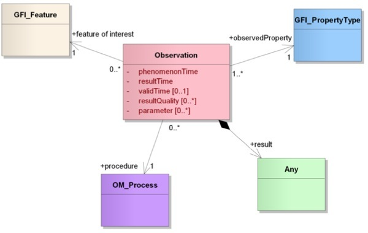
      
O&M XML Example
----------------
      
Lets walk through an example from `Geonovum <http://geostandards.geonovum.nl/index.php/5.3.2_O%26M#Measurement_Example>`_      
      
      
O&M XML Header
---------------
.. code-block:: xml
   
     <?xml version="1.0" encoding="windows-1250"?>
          <om:Measurement gml:id="obsTest"
             xmlns:om="http://www.opengis.net/om/1.0"
             xmlns:xsi="http://www.w3.org/2001/XMLSchema-instance" 
             xmlns:xlink="http://www.w3.org/1999/xlink"
             xmlns:gml="http://www.opengis.net/gml"
               xsi:schemaLocation="http://www.opengis.net/om/1.0 
               ../extensions/observationSpecialization_override.xsd">
   
O&M XML Time
---------------
.. code-block:: xml   

   <om:samplingTime>
     <gml:TimeInstant>
       <gml:timePosition>2008-10-14T00:09:53+02:00</gml:timePosition>
     </gml:TimeInstant>
   </om:samplingTime>
   
O&M XML Procedure
--------------------
.. code-block:: xml

   <om:procedure 
      xlink:href=
            "urn:ogc:object:feature:OSIRIS-HWS:
               a1ef1094-c201-4f9f-8f2e-0ff97bf65f03"/>
 
O&M XML Observed Property
--------------------------
.. code-block:: xml 
   
   <om:observedProperty 
      xlink:href="urn:x-ogc:def:property:OGC::RelativeHumidity"/>
 
O&M XML Feature of Interest 
-----------------------------
.. code-block:: xml  

      <om:featureOfInterest>
            <sa:SamplingPoint 
         gml:id=
            "urn:ogc:object:feature:OSIRIS-HWS:
               a1ef1094-c201-4f9f-8f2e-0ff97bf65f03" 
         xsi:type="ns:SamplingPointType" 
            xmlns:ns="http://www.opengis.net/sampling/1.0" 
         xmlns:gml="http://www.opengis.net/gml">
       <gml:name>roof of the ifgi</gml:name>
       <sa:sampledFeature 
         xlink:href="urn:ogc:object:feature:
            OSIRIS-HWS:hygrometera1ef1094-c201-4f9f-8f2e-0ff97bf65f03"/>
       <sa:position>
         <gml:Point srsName="urn:ogc:def:crs:EPSG:4326">
           <gml:pos>52.07349 9.42125</gml:pos>
         </gml:Point>
       </sa:position>
     </sa:SamplingPoint>
   </om:featureOfInterest>
   
O&M XML Observed Property
--------------------------
.. code-block:: xml   

      <om:result uom="%" 
         xlink:href="urn:x-ogc:def:uom:OGC:percent" >41
      </om:result>
   </om:Measurement>
 

      

SWE Services
==============

SWE Services
--------------

- **Sensor Observation Service** – Access observations and descriptions for sensor systems
- **Sensor Alert Service**  – Subscribe to alerts based upon sensor observations
- **Sensor Planning Service** – Request collection feasibility and task sensor system for desired observations
- **Web Notification Service** – Manage message dialogue between client services for long duration (asynchronous) processes
- **Sensor Registries** – Discover sensors and sensor observations

SWE Services
--------------
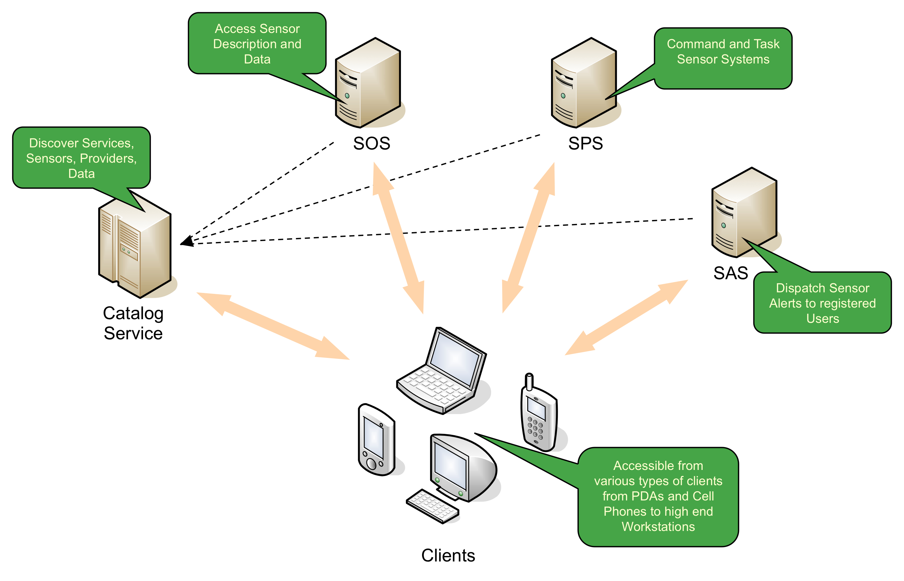

SOS Operations
------------------

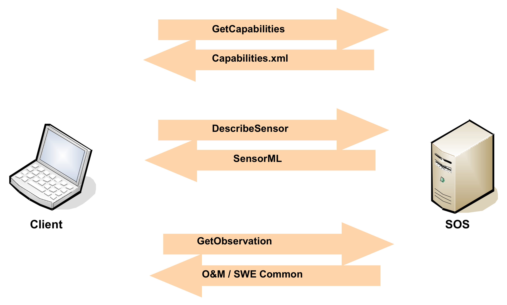

      
SWE and Geo-processing Workflow
--------------------------------

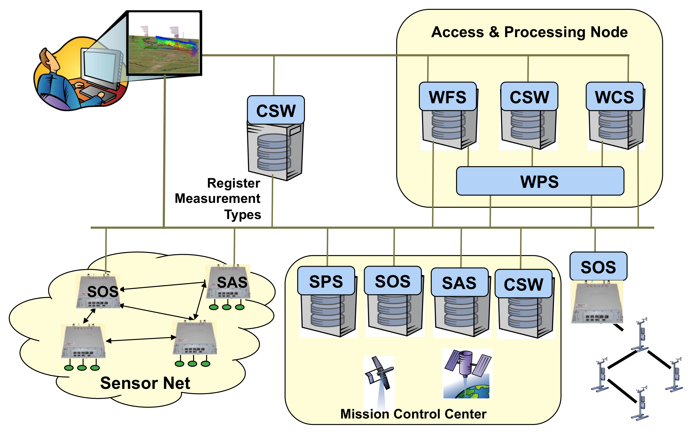
      
 
SWE in Defense 
----------------------------------------
 
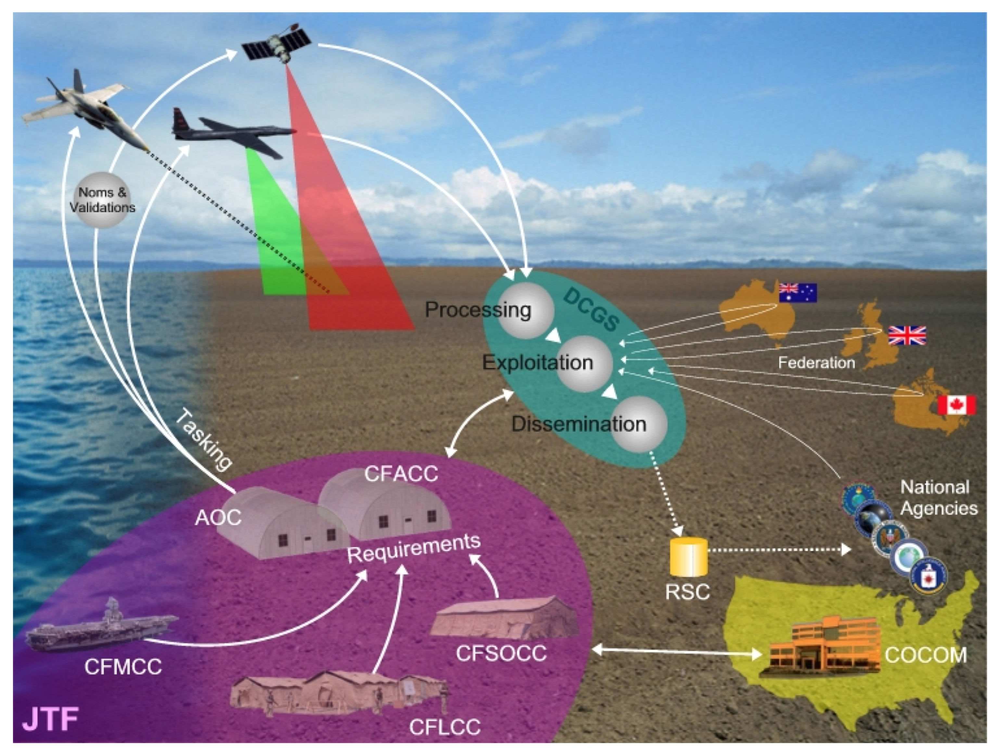

SWE in Air Quality 
----------------------------------------
 
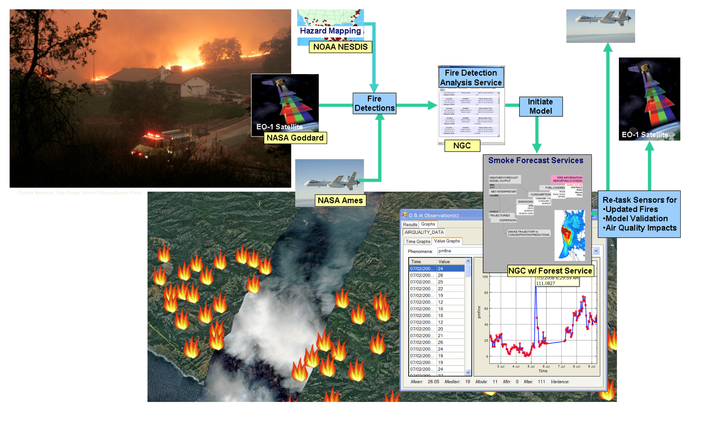

KML
====
This tutorial provides an introduction to KML

KML is used for
----------------

* Annotate the Earth 
* Specify icons and labels to identify locations on the surface of the planet 
* Create different camera positions to define unique views for KML features 
* Define image overlays to attach to the ground or screen 
* Define styles to specify KML feature appearance 

KML is used for
-----------------

* Write HTML descriptions of KML features, including hyperlinks and embedded images 
* Organize KML features into hierarchies 
* Locate and update retrieved KML documents from local or remote network locations 
* Define the location and orientation of textured 3D objects 

KML Example
-------------

.. code-block:: xml

    <kml xmlns="http://www.opengis.net/kml/2.2">
        <Document>
           <name>Document.kml</name> <open>1</open>
           

KML Example
-------------
.. code-block:: xml
           
           <Placemark>
               <name>Document Feature 1</name> 
               <styleUrl>#exampleStyleDocument</styleUrl>
               <Point>
                  <coordinates>-122.371,37.816,0</coordinates>
               </Point>
           </Placemark>

KML Example
-------------
.. code-block:: xml
           
           <Placemark>
               <name>Document Feature 2</name>
               <styleUrl>#exampleStyleDocument</styleUrl>
               <Point>
                  <coordinates>-122.370,37.817,0</coordinates>
               </Point>
           </Placemark>
      </Document>
    </kml>

WPS 
=================

This tutorial provides an introduction to the  OGC Web processing Service (WPS) Interface Standard.

Geoprocessing
--------------

A GIS operation used to manipulate GIS data.

Examples?

Data Processing
----------------

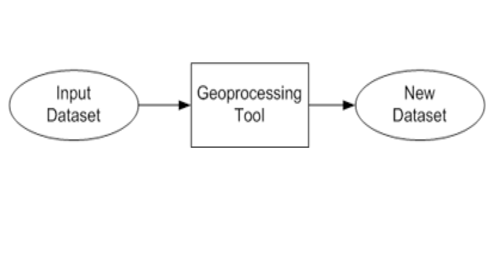
      
Types of Operations
---------------------
- Feature Overlay
- Feature Selection
- Topology processing
- Raster processing
- Data Conversion
- Feature Analysis

Web Processing Service
-----------------------
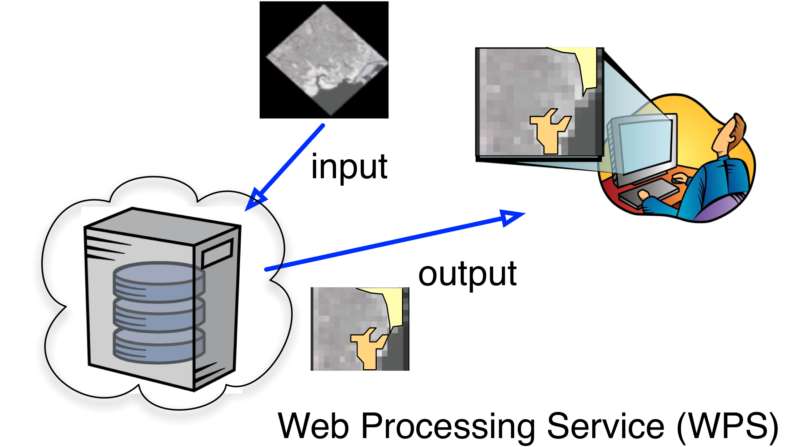
      
      
Classification
-----------------------
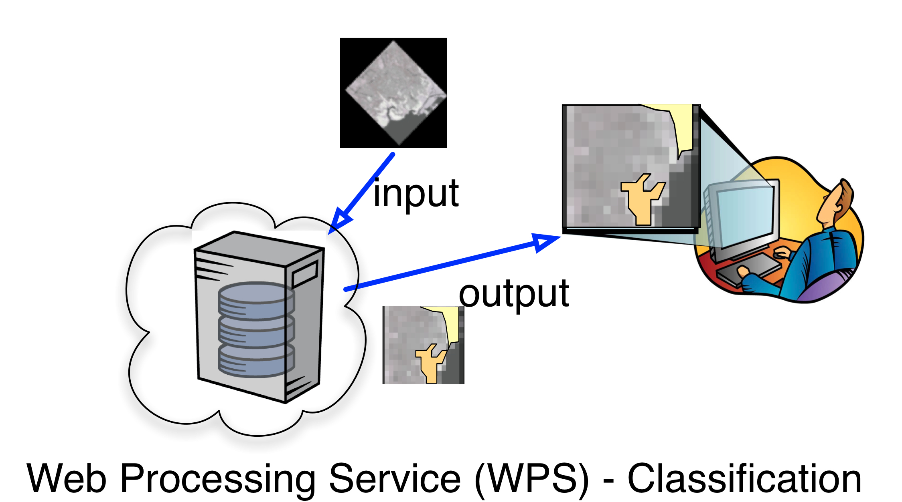
      
      
Model Run
-----------------------
.. image:: ../wps/img/modelrunning.jpg
      :height: 654
      :width: 1049  
      
      
Workflows
-----------------------
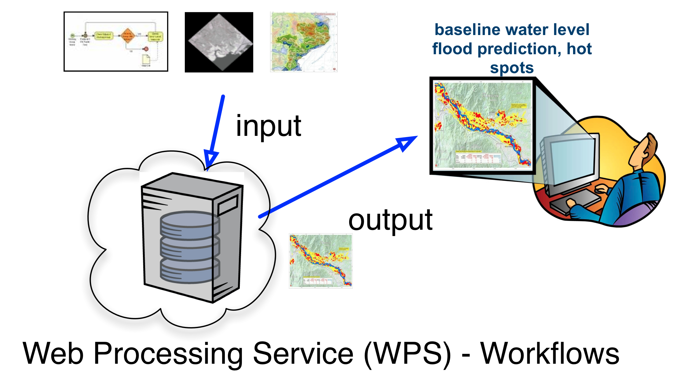
      
Reusability
-----------------------
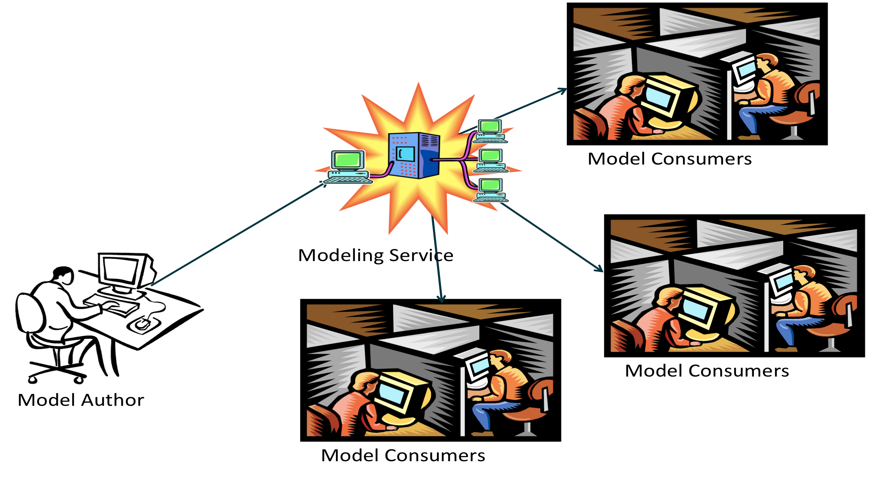
      
Operations
-----------
- *GetCapabilities* returns information about the service
- *DescribeProcess* returns details of a specific process including its inputs and outputs
- *Execute* returns, for a specific process, the output(s) of a process

Parameters DescribeProcess
----------------------------
- service
- request
- describeProcess
- identifier

Input
--------
- URL
- GML
- Image
- Data

Output
------
- URL
- GML
- Image
- Another service

Open Layers Demo
-----------------
http://openlayers.org/dev/examples/wps.html

- inspect process types
- run a buffer operation

52North Demo
--------------
http://geoprocessing.demo.52north.org:8080/wps/test.html

- run the default buffer operation
- what can I input to the process?

52North Demo
-------------
Use another feature collection as input. 

For example `this getFeature request <http://demo.opengeo.org/geoserver/og/ows?service=WFS&amp;version=1.0.0&amp;request=GetFeature&amp;typeName=og%3Astreams&amp;maxfeatures=1&outputformat=GML3>`_

   
   

Web Feature Service (WFS) Tutorial
======================================

This tutorial provides an introduction to WFS.

Feature
--------------
.. image:: ../wfs/img/feature.jpg
      :height: 654
      :width: 1049 
      

Feature has Properties
------------------------
.. image:: ../wfs/img/geo-feature.jpg
      :height: 654
      :width: 1049    

Geospatial Feature
---------------------
.. image:: ../wfs/img/geo-feature.jpg
      :height: 654
      :width: 1049 
      
 
         
Generalization
---------------------
Class = Feature Type = Tree

Properties of Tree:

- Height
- Location

All my Trees will have a height and location.

Feature Instance
-----------------
| My favorite tree in Cartagena is the one in front of the hotel Colombia.
| Height = 5 mt
| Location: Latitude, Longitude
| 10.407793,-75.551262

Features Modeling  
------------------
.. image:: ../wfs/img/modeling.jpg
      :height: 654
      :width: 1600 
      
      
      

Geographic Markup Languaae (GML)
---------------------------------

.. code-block:: xml

    <Bridge>
      100
      <height>200</height>
      <gml:centerLineOf>
        <gml:LineString>
           <gml:pos>100 200</gml:pos>
           <gml:pos>200 200</gml:pos>
        </gml:LineString>
      </gml:centerLineOf>
    </Bridge>

Feature Instance of Type Bridge
---------------------------------

.. code-block:: xml

    <Bridge>
      100
      <height>200</height>
      <gml:centerLineOf>
        <gml:LineString>
           <gml:pos>100 200</gml:pos>
           <gml:pos>200 200</gml:pos>
        </gml:LineString>
      </gml:centerLineOf>
    </Bridge>

Feature Types are defined in GML
---------------------------------

.. code-block:: xml

    <xs:complexType name="BridgeType">
         <xs:complexContent>
              <xs:extension base="gml:AbstractFeatureType">
                  <xs:sequence>
                  <xs:element name="span"  type="xs:integer"/>
                  <xs:element name="height" type="xs:integer"/> 
                     <xs:element ref="gml:centerLineOf"/>
                   </xs:sequence>
                </xs:extension>
         </xs:complexContent>
     </xs:complexType>

GML Provides
-------------
- Defines an abstract feature model
- Provides XML Schemas
- Provides primitives:
  
   - Geometry
   - Feature Types
   - Coordinate Reference Systems

GML Geometries
---------------
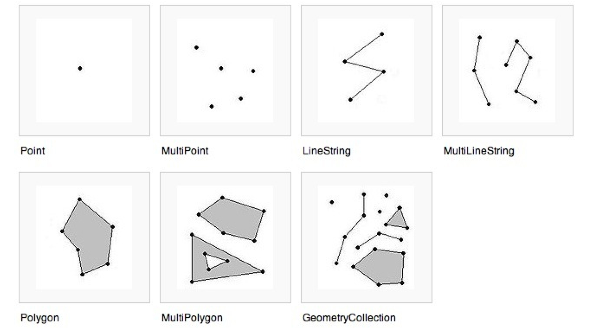

How can I model a radio station?
---------------------------------

How can I model a radio station?
---------------------------------

Point - when looking at a country map

How can I model a radio station?
---------------------------------

Polygon - location of the building

How can I model a radio station?
---------------------------------

Multipolygon - Area of Transmition

Communities develop their own Application Schemas
---------------------------------------------------
- AIXM – Aviation 
- CAAML – Canadian avalanches 
- CityGML – 3D city models 
- CSML –  Climate Science Modelling
- DAFIF – Defense aviation
- GeoSciML -  Geoscience 
- ...

      

Web Feature Service (WFS)
--------------------------
- Service (Protocol)
- Do the following with Geographic Features:

   •  publish 
   •  access
   •  manipulate

WFS Operations
----------------

- *getCapabilities* - summary of the service
- *DescribeFeatureType* - structure of the feature types
- *GetFeature* - get the feature instance
- *Transaction* - create, update and delete geographic features
- *Lock Feature* - Protects feature record when updating it.
 

GeoServer Demo
---------------

 - GeoServer is the reference implementation for WFS 1.1.0.
 - Open and free software
 - Java-based
 
GeoServer Demo
---------------

- http://localhost:8080/geoserver/web/
- click on Demos
- Explore Operations

Example GetCapabilities Request
--------------------------------

Request example::

   http://localhost:8080/geoserver/topp/ows?
   service=WFS&
   version=1.0.0&
   request=GetCapabilities
   

`Link to GetCapabilities <http://localhost:8080/geoserver/topp/ows?service=WFS&version=1.0.0&request=GetCapabilities>`_

Example DescribeFeature Request
--------------------------------

Request example::

   http://localhost:8080/geoserver/topp/ows?
    service=WFS&
    version=1.1.0&
    request=DescribeFeatureType&
    typeName=topp:tasmania_water_bodies

`Link to DescribeFeature <http://localhost:8080/geoserver/topp/ows?service=WFS&version=1.1.0&request=DescribeFeatureType&typeName=topp:tasmania_water_bodies>`_

Example GetFeature Request
---------------------------

Request example::

   http://localhost:8080/geoserver/topp/ows?
   service=WFS&version=1.1.0&request=getFeature&
   TypeName=topp:tasmania_water_bodies

`Link to getFeature request <http://localhost:8080/geoserver/topp/ows?service=WFS&version=1.1.0&request=getFeature&TypeName=topp:tasmania_water_bodies>`_

Query based on values of properties  
------------------------------------

 Lakes with area > 1067000000 cm. 
 
.. code-block:: xml
 
    http://localhost:8080/geoserver/topp/ows?
      service=WFS&version=1.1.0&request=getFeature&
      TypeName=topp:tasmania_water_bodies&
      FILTER=
         <Filter xmlns="http://www.opengis.net/ogc">
           <PropertyIsGreaterThan>
             <PropertyName>AREA</PropertyName>
             <Literal>1067000000</Literal>
           </PropertyIsGreaterThan>
         </Filter>
 
 
`Link to GetFeature with filter <http://localhost:8080/geoserver/topp/ows?service=WFS&version=1.0.0&request=GetFeature&typeName=topp:tasmania_water_bodies&maxFeatures=50&outputFormat=GML2&&FILTER=%3CFilter%20xmlns=%22http://www.opengis.net/ogc%22%3E%3CPropertyIsGreaterThan%3E%3CPropertyName%3EAREA%3C/PropertyName%3E%3CLiteral%3E1067000000%3C/Literal%3E%3C/PropertyIsGreaterThan%3E%3C/Filter%3E>`_
 
 
Client - Server Demo
----------------------
- Open uDIG
- Connect with geoserver: 
   http://localhost:8080/geoserver/topp/ows
   

References
------------

OGC Standards
   http://www.opengeospatial.org/standards

GML Application Profiles
   http://www.ogcnetwork.net/gmlprofiles
      
GeoServer
   http://docs.geoserver.org/stable/en/user/data/vector/index.html
         
uDIG
   http://udig.refractions.net   
   

         

 

 
 
   
    

