Diseño de Servicios Web para Catastro
======================================

- Catastro
- Servicios Web
- Servicios OGC para Catastro

Catastro
----------

Sistema de información territorial del Estado, 
que tiene como finalidad obtener un inventario 
analítico de los inmuebles con base en sus características;

Definición Mexico
------------------

*LEY DE CATASTRO DEL ESTADO DE MÉXICO 1997 - Art 2*

Catastro; al sistema de información territorial del Estado, que tiene como finalidad obtener un inventario analítico de los inmuebles con base en sus características;
Actividad catastral; al conjunto de procedimientos y acciones que permiten integrar, conservar y mantener actualizado el inventario analítico de los inmuebles; 

Producto... un mapa
-------------------

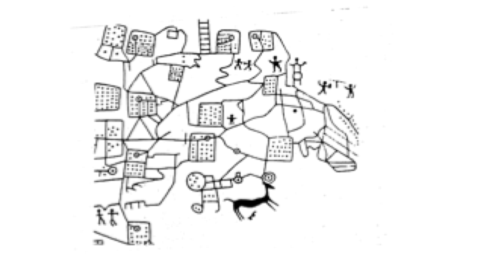
 
.. Como  ocurrio con la ciudad de Dungui , en Caldea (deserto árabe) 4000 a.C. 
   Un tabla de barro se mostro las parcelas, el area, la distribucion dando una 
   inforamcion importanta para los gobernantes. 
  
Mapa Catastral Moderno
------------------------

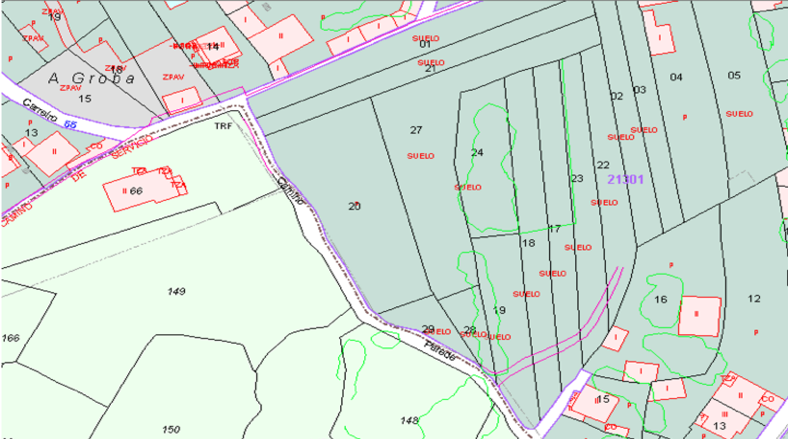

.. Y mas actualmente un mapa creado digitalmente pr un programa de puede procesar 
   informacion vecotrial, entender de sistema de coordenadas, entender estilos 
   donde dependiendoe del tipo de predio la parcela se presenta de color distinto, 
   donde se puede mostrar un identficar que distingue a una parcela de otra y otros 
   detalles que facilitan la experiencia del usuario final. Ya sea un experto que trabaja 
   en planeacion o un usuario final que quiere tener mas inforamcion acerca de su predio u 
   otro predio de interes del vecino o uno a punto de ser comprado

Sistema de Información Catastral 
----------------------------------
- Procesamiento de información vectorial
- Entendimiento de sistema de coordenadas
- Procesamiento de estilos (colores, lineas)
- Extraer informacion acerca de una parcela (dueño, valor)

Informacion acerca de una Parcela
------------------------------------

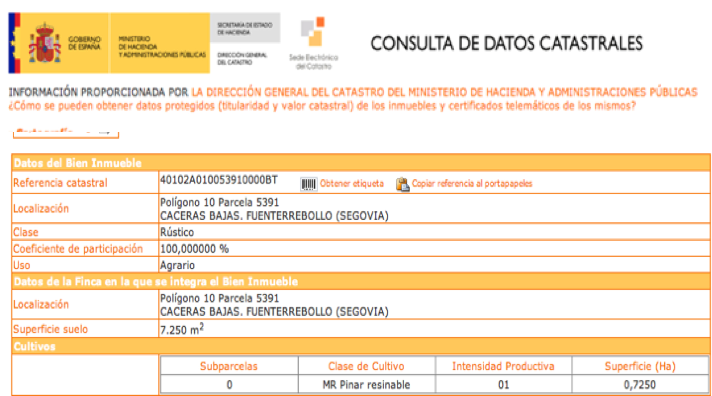

Modelo Conceptual - UML 
----------------------------
- Captura formalmente los tipos de datos a usar
- Se utuliza para generar XML schemas, APIs y bases de datos
- Ejemplo: http://inspire.ec.europa.eu/index.cfm/pageid/2

Specificación  INSPIRE
-------------------------
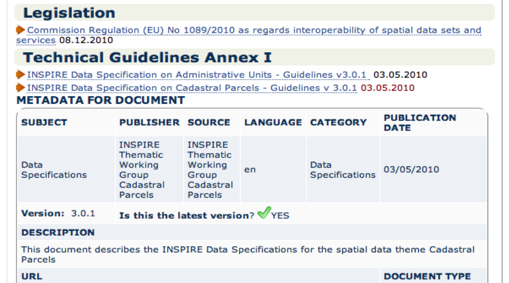

Modelo UML Catastral
------------------------------------

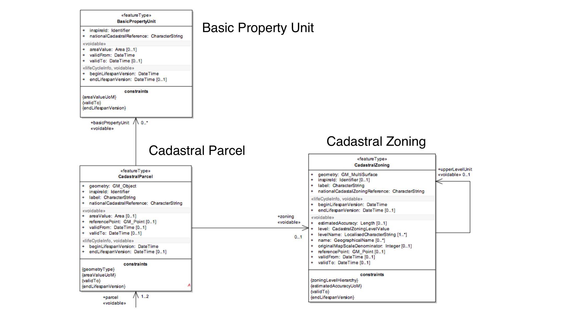
      
Modelo UML Catastral
------------------------------------

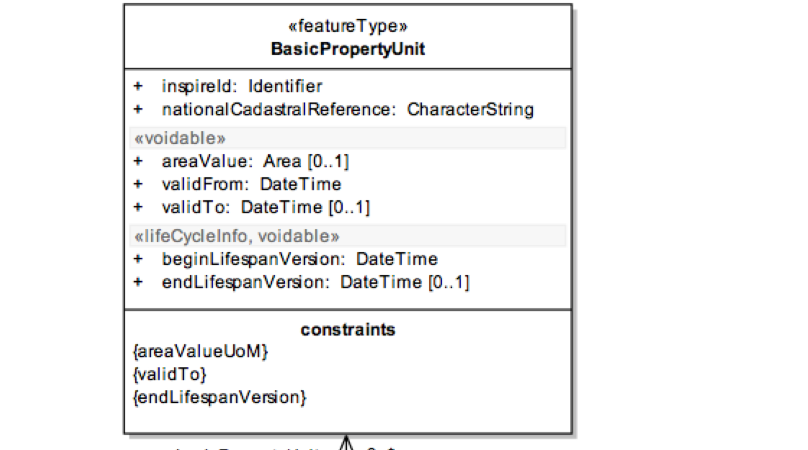
      
Modelo UML Catastral
------------------------------------

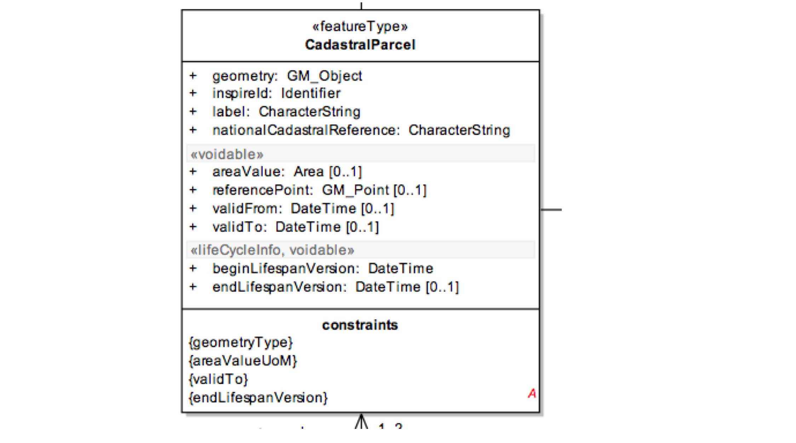
      
Modelo UML Catastral
------------------------------------

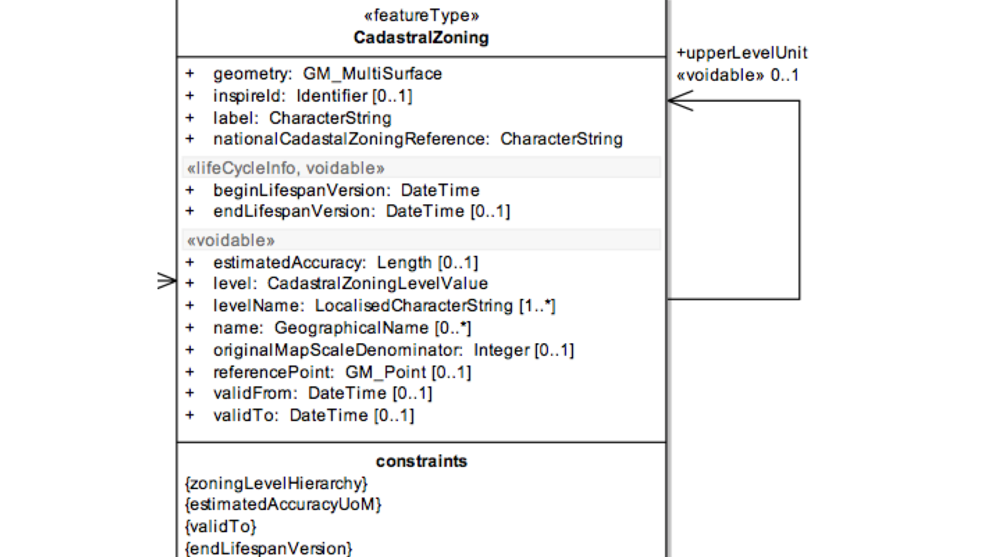
      
ISO Standard
--------------
- ISO/WD 19152.3
- Geographic information — Land Administration Domain Model (LADM)
- `Documento en ISO <http://www.iso.org/iso/home/store/catalogue_tc/catalogue_detail.htm?csnumber=51206>`_ 
- `Document público <http://www.gdmc.nl/oosterom/ISO19152LADM_CD.pdf‎>`_
  
 
Modelo UML Catastral - ISO
--------------------------
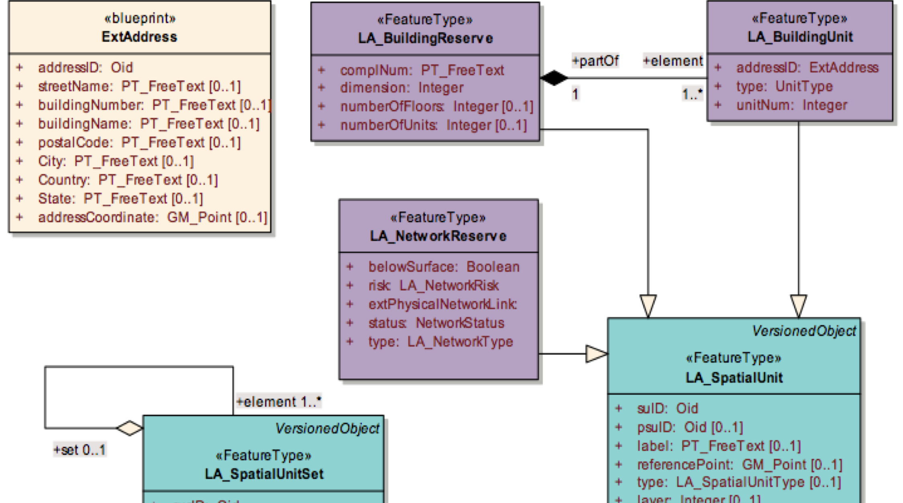
      
Modelo UML Catastral - ISO
--------------------------
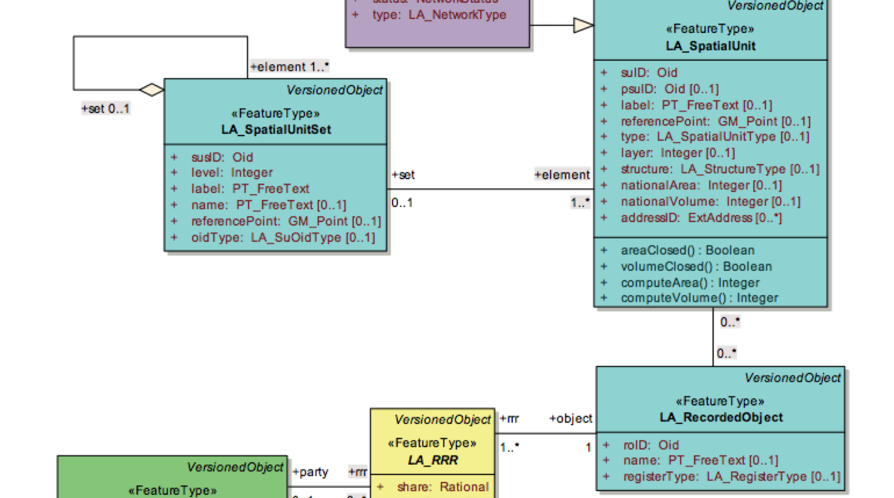
      

Proceso para inspecciones
----------------------------
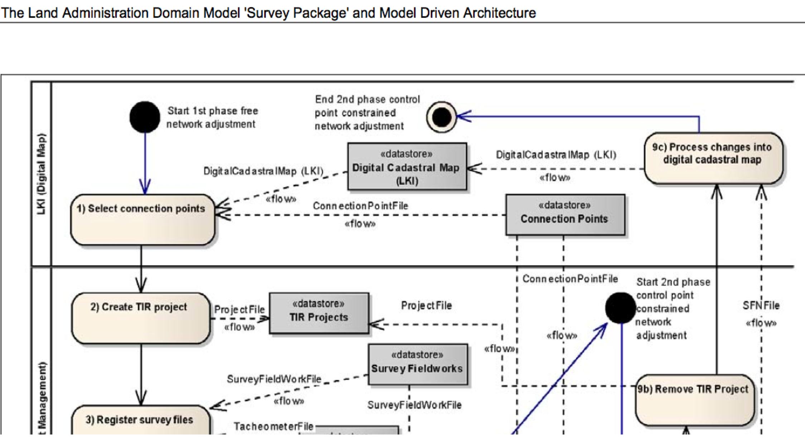
      
Proceso para inspecciones
----------------------------
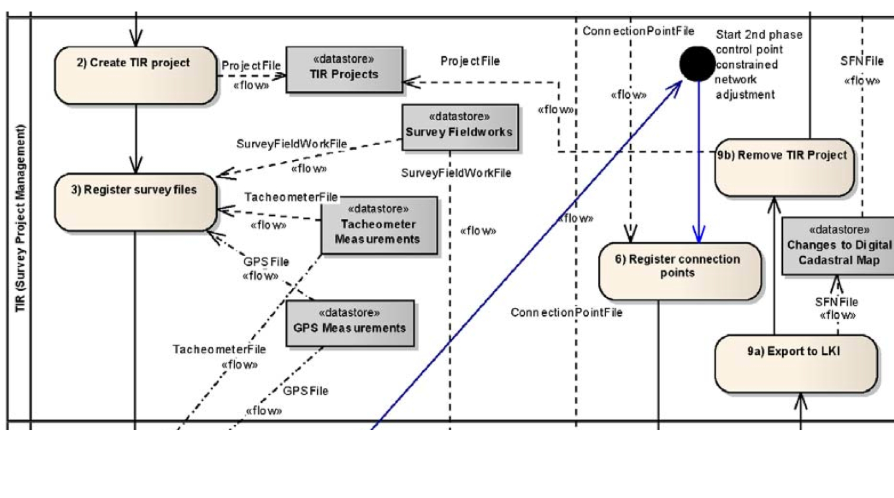
             
     
