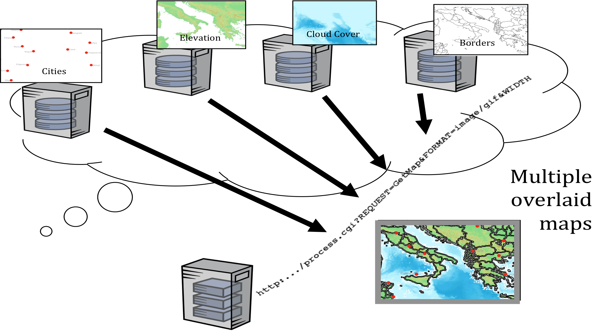
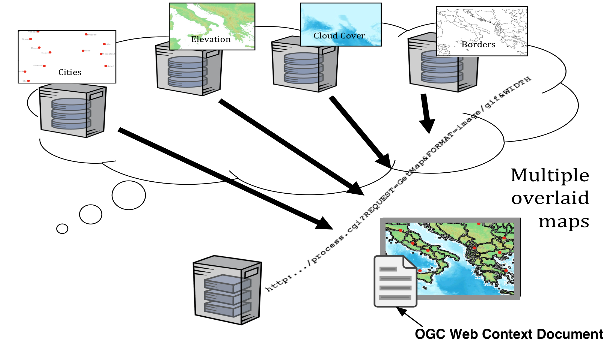
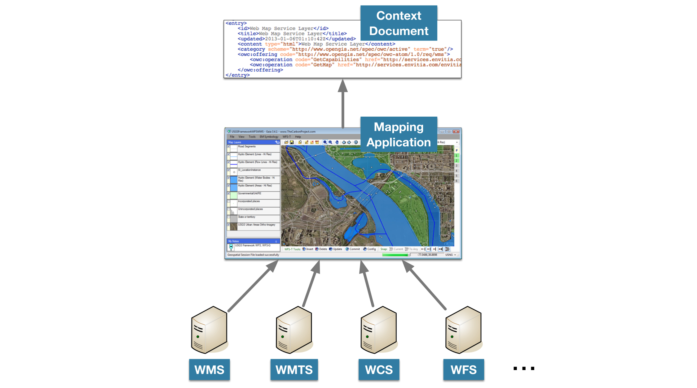

OGC Web  Context
================

A Map from different sources
----------------------------

      
.. the difficult part is sharing this context      
      
How do we share the map?
------------------------
      

      
.. A context can be specified in a document that can be shared with colleagues   

For example sharing via Email
-----------------------------

.. image:: ../img/user-gets-email.jpg
      :height: 800
      :width: 1200 
      
Sources
-------

Anatomy of a context document
-----------------------------

- A context document extends the Atom XML format (or in the future JSON).
- It contains Atom <entries> which have OGC <offering>s. 
- Offerings are data sources: Services (e.g. WMS, WFS, WMTS and WCS) or file-based data sets (e.g like GML, KML and PDF).
- File-based data sets may be specified by reference with a URL, or included inline.
- OGC service offerings contain a GetCapabilites request and a request to get data, such as GetMap, GetTiles, GetFeature, etc.
- Offerings do not have to be spatial, so clients implementing Context should handle non-spatial offerings in a way other than mapping them.

Example WMS
-----------

.. code-block:: xml
   
   <entry>
      <owc:offering 
      code="http://www.opengis.net/spec/owc-atom/1.0/req/wms">      
      <owc:operation code="GetCapabilities" method="GET"            
         type="application/xml" 
         href="http://aserver/wms?          
         SERVICE=WMS&amp;VERSION=1.3.0&amp;
            REQUEST=GetCapabilities"/>
      <owc:operation code="GetMap" method="GET" type="image/png"      
         href="http://http://aserver/wms?             
            SERVICE=WMS&amp;VERSION=1.1.1&amp;
            REQUEST=GetMap ...
         
            "/>      
      </owc:offering>
   </entry>
   
   
Example WMS
-----------

.. code-block:: xml

   <owc:operation code="GetMap" method="GET" type="image/png"      
      href="http://http://aserver/wms?            
         SERVICE=WMS&amp;
         VERSION=1.1.1&amp;
         REQUEST=GetMap&amp;            
         SRS=EPSG:4326&amp;
         BBOX=-2,45,8,55&amp;
         WIDTH=500&amp;
         HEIGHT=500&amp;        
         LAYERS=385d7d71-650a-:MER_RR__2P000262.tif&amp;
         FORMAT=image/png&amp;            
         BGCOLOR=0xffffff&amp;
         TRANSPARENT=TRUE&amp;            
         EXCEPTIONS=application/vnd.ogc.se_xml"/>
   
Example WFS
-----------
 
.. code-block:: xml
	
   <entry>
     <owc:offering code="http://www.opengis.net/spec/owc-atom/1.0/req/wfs">
       <owc:operation method="GET” 
         code=" href="http://aService/wfs? 
         SERVICE=WFS&amp;VERSION=1.0.0&amp;
         REQUEST=GetCapabilities" 
         type="text/xml" />
       <owc:operation method="GET" 
         code="GetFeature" href="http://aService/wfs? 
         SERVICE=WFS&amp;VERSION=1.1.0&amp;
         REQUEST=GetFeature&amp; 
         NAMESPACES=
            xmlns(tds,http:%2F%2Fmetadata.dod.mil%2Fmdr%2Fns%2FGSIP%2F3.0%2Ftds%2F3.0)&amp;
         OUTPUTFORMAT=text/xml;%20subtype=gml/3.2.1&amp; 
         BBOX=-90,-180,90,180&amp;
         TYPENAME=gml:AbstractFeature" />
     </owc:offering>
   </entry>

Status
------

- Publicly available version 1.0 soon
- https://portal.opengeospatial.org/files/?artifact_id=56598 

   
   