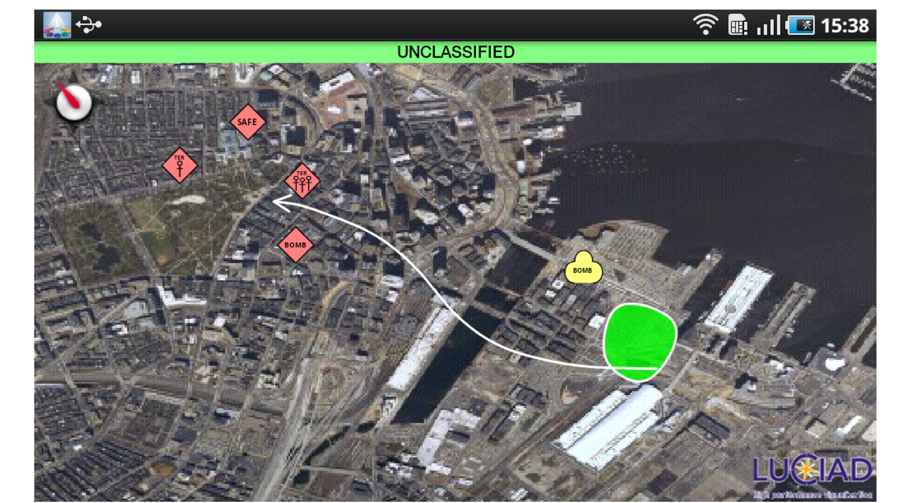
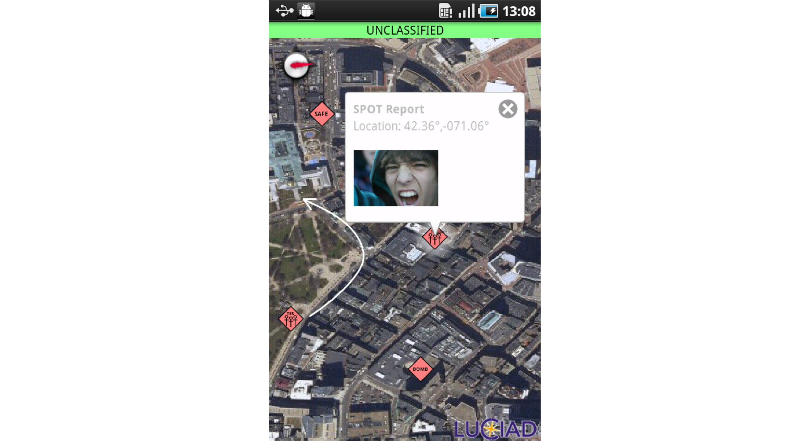
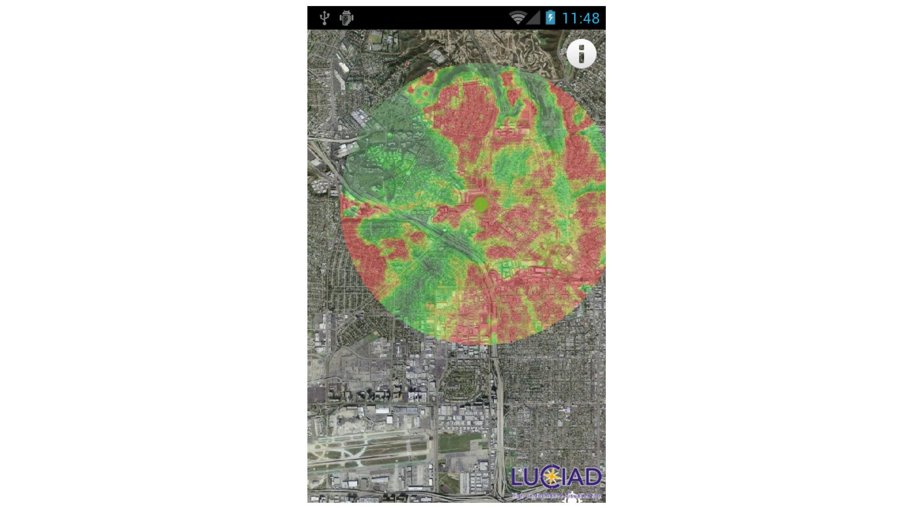
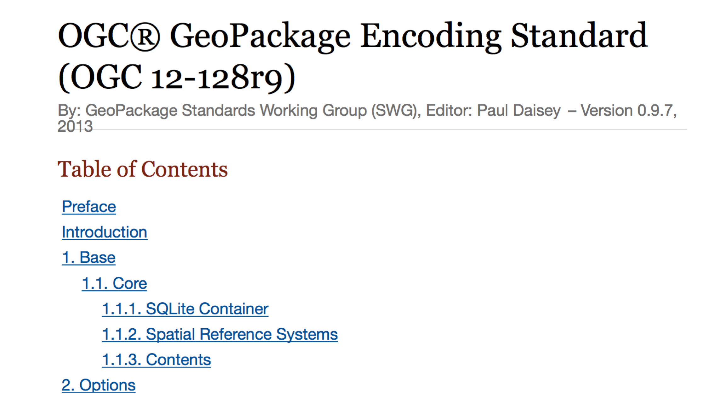
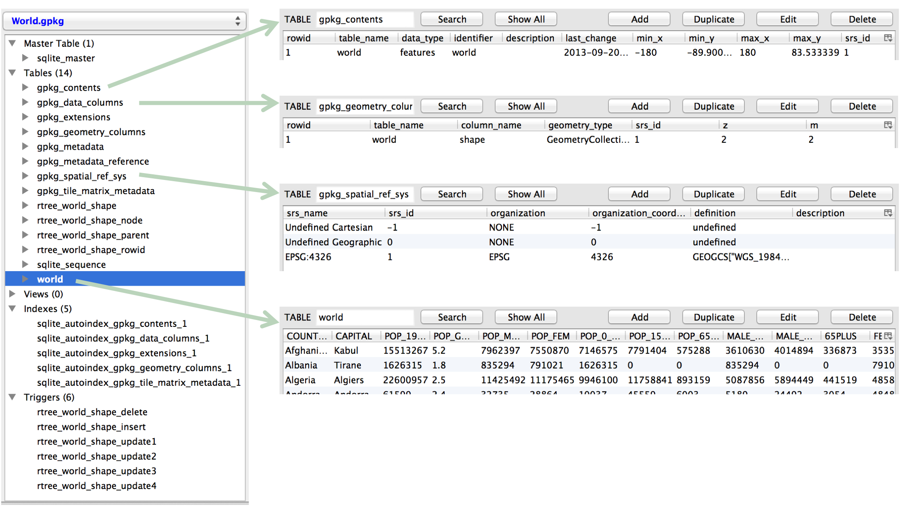

GeoPackage
==========

Motivation
----------
- Shapefiles, as a format, are dinosaurs
- web services don’t work without internet access
- internet sucks power from a mobile device

Overview
--------
A GeoPackage is a platform-independent SQLite database file. It may contain:
   
   - Data in any geographic or projected CRS using any Datum
   - Vector Feature User Data Tables
      
      - GP BLOB Geometry Binary Format containing WKB Geometries
      - Linear 2D Geometries with optional elevation and measure values
   
   - Tile Matrix Pyramid User Data Tables
      
      - PNG and JPEG Tiles
      - Zoom times two (adjacent zoom level pixel sizes)

First Open Source Implementation
--------------------------------
Luciad libgpkg
   https://bitbucket.org/luciad/libgpkg
   A SQLite 3 extension that provides a minimal implementation
   Distributed under the Apache Software License version 2.0

Create and edit annotations in the field
----------------------------------------

Spot reporting
--------------

      
Access elevation data
---------------------

      
Specification at GitHub
-----------------------
http://opengis.github.io/geopackage/ 

      

      
      
      

GeoPackage Table for Features
-----------------------------
gpkg_spatial_ref_sys
   defines spatial reference systems
   
gpkg_contents
   identifies user data tables

gpkg_geometry_columns
   identifies feature geometries

user_data_feature_tables
   contain feature data

Example SQL Tables
------------------

GeoPackage Table for Tiles
--------------------------
gpkg_spatial_ref_sys
   defines spatial reference systems
gpkg_contents
   identifies user data tables
gpkg_tile_matrix_set
   tile pyramid envelope
gpkg_tile_matrix
   describes tile zoom levels
user_data_tiles_tables
   contain tile pyramids

GeoPackage Status
-----------------

- currently in final voting status by OGC for public adoption.
- vote closes in early January 2014
- http://opengis.github.io/geopackage/ 

