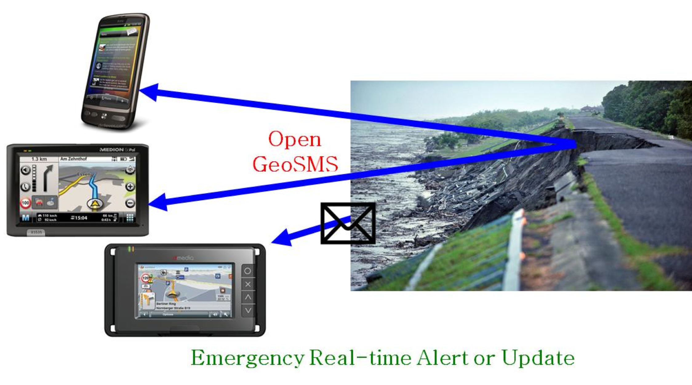
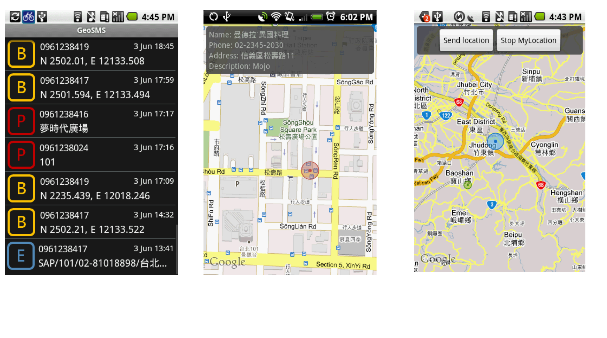

Open GeoSMS
============

Overview
--------
Open GeoSMS is an open-coordinate short message service (SMS) standard to allow transmission of map information and communications among different platforms of digital maps. The goal is to share location information across operating systems and applications.

Real Time Alerts
----------------

      
Characteristics
---------------
- Multilingual
- Multi-device
- Harmonized with many existing applications
- Incorporates relevant ISO standards

Compatible with other  standards
--------------------------------

Open GeoSMS encoding for location is compatible with other OGC standards, such as those for sensor webs and earth imaging. 

It is also compatible with standards such as the OASIS Common Alerting Protocol (CAP) standard and the IETF RFC Presence Information Data Format Location Object (PIDF-LO). 

Organizations using Open GeoSMS
-------------------------------

Free App: Open GeoSMSer
-----------------------

- Free download from Android Marketplace
- Get GPS data and send Open GeoSMS to your contact
- Receive Open GeoSMS, bring up map and POI info
- Developed with Open GeoSMS SDK from ITRI

      
