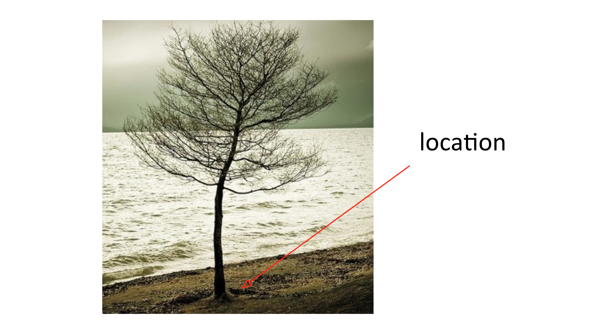
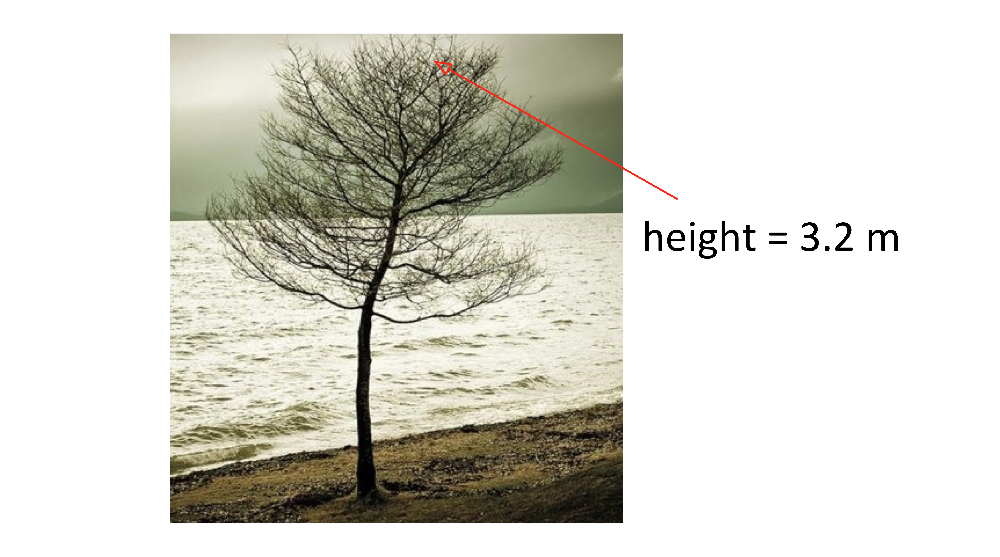
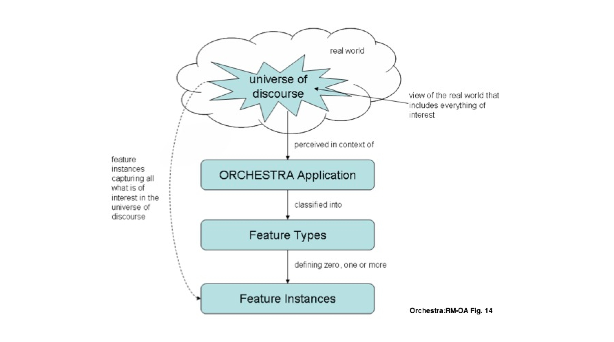

Geographic Modeling Language (GML)
==================================

Feature
-------

      

Feature has Properties
----------------------

Geospatial Feature
------------------

      
 
         
Generalization
--------------
Class = Feature Type = Tree

Properties of Tree:

- Height
- Location

All my Trees will have a height and location.

Feature Instance
----------------
| My favorite tree in Cartagena is the one in front of the hotel Colombia.
| Height = 5 mt
| Location: Latitude, Longitude
| 10.407793,-75.551262

Features Modeling
-----------------

      
 

Geographic Markup Language (GML)
--------------------------------

.. code-block:: xml

    <Bridge>
      100
      <height>200</height>
      <gml:centerLineOf>
        <gml:LineString>
           <gml:pos>100 200</gml:pos>
           <gml:pos>200 200</gml:pos>
        </gml:LineString>
      </gml:centerLineOf>
    </Bridge>

Feature Instance of Type Bridge
-------------------------------

.. code-block:: xml

    <Bridge>
      100
      <height>200</height>
      <gml:centerLineOf>
        <gml:LineString>
           <gml:pos>100 200</gml:pos>
           <gml:pos>200 200</gml:pos>
        </gml:LineString>
      </gml:centerLineOf>
    </Bridge>

Feature Types are defined in GML
--------------------------------

.. code-block:: xml

    <xs:complexType name="BridgeType">
         <xs:complexContent>
              <xs:extension base="gml:AbstractFeatureType">
                  <xs:sequence>
                  <xs:element name="span"  type="xs:integer"/>
                  <xs:element name="height" type="xs:integer"/> 
                     <xs:element ref="gml:centerLineOf"/>
                   </xs:sequence>
                </xs:extension>
         </xs:complexContent>
     </xs:complexType>

GML Provides
------------
- Defines an abstract feature model
- Provides XML Schemas
- Provides primitives:

   - Geometry
   - Feature Types
   - Coordinate Reference Systems

GML Geometries
--------------
.. image:: ../img/geometries.jpg
      :height: 654
      :width: 1049 

How can radio station be modeled?
---------------------------------

- Point - when looking at a country map
- Polygon - location of the building
- Multipolygon - Area of Transmition

Communities develop their own Application Schemas
-------------------------------------------------
- AIXM – Aviation
- CAAML – Canadian avalanches
- CityGML – 3D city models
- CSML –  Climate Science Modelling
- DAFIF – Defense aviation
- GeoSciML -  Geoscience
- ...
