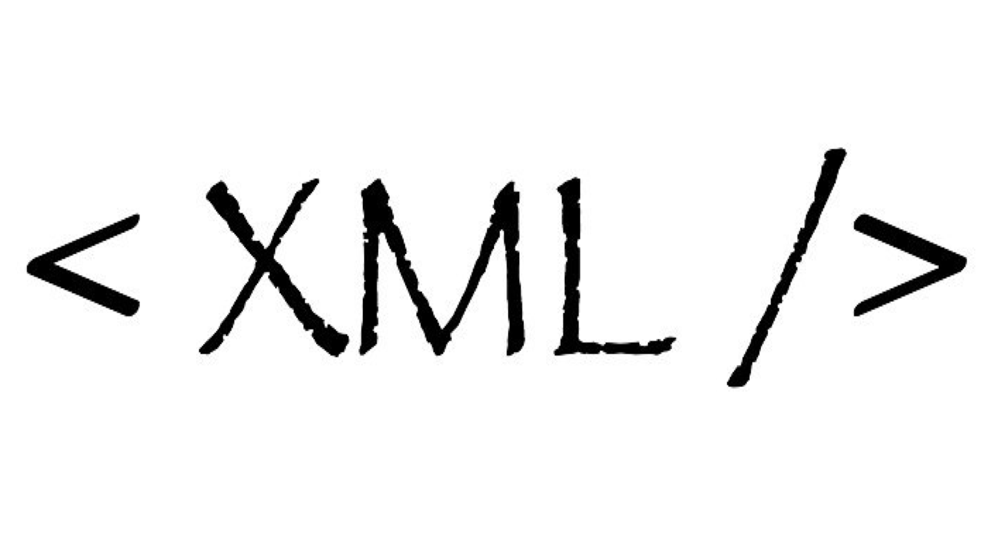
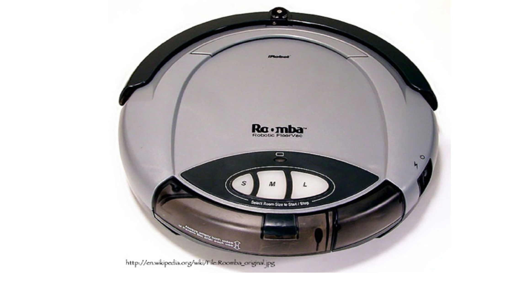
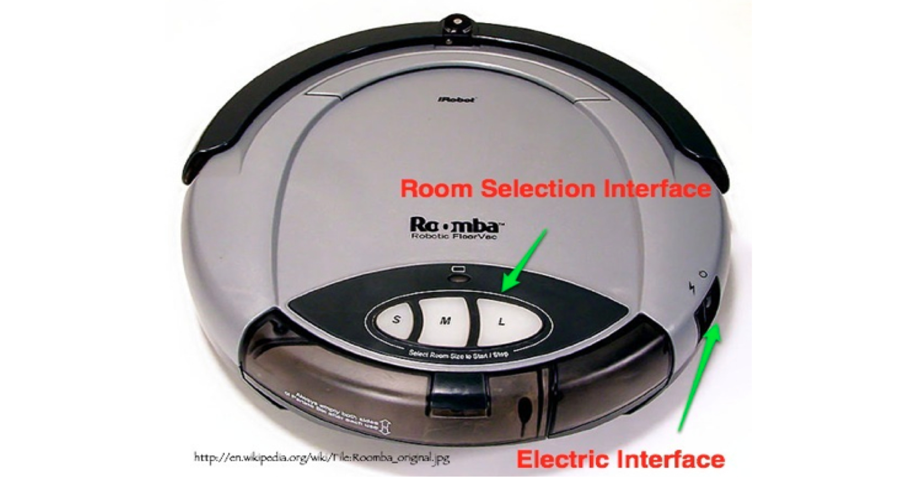

Introduction to Distributed Computing and Web Services
======================================================

Publishing Geospatial Data
--------------------------

.. image:: ../img/first-map.jpg
      :height: 654
      :width: 1049  
  
Publishing Geospatial Data
--------------------------

.. image:: ../img/mobile-map.jpg
      :height: 654
      :width: 1049  

What changed?
-------------

What changed?
-------------

.. image:: ../img/technology.jpg
      :height: 654
      :width: 1049  

What is this?
-------------
.. image:: ../img/internet-colors.jpg
      :height: 654
      :width: 1049  
      
Internet
--------
.. image:: ../img/internet-colors.jpg
      :height: 654
      :width: 1049  

World Wide Web
--------------
* Enabled by Internet
* All **Information** from Computers connected around the world.

How do we connect to the Web?
-----------------------------
- URL
- HTTP GET
- Protocols
- Encodings
- ...

Uniform Resource Locator (URL)
------------------------------
- http://my.umbc.edu/
- ftp://ftp.funet.fi/pub/standards/RFC/rfc959.txt
- mailto:bermud@me.com

Every node can be a URL
-----------------------
.. image:: ../img/internet-colors.jpg
      :height: 654
      :width: 1049 

Protocols
---------

Protocols
---------
- TCP/IP
- HTTP (GET, POST)

HTTP GET is a URL
-----------------

::

   http://localhost:8080/geoserver/topp/ows?
   service=WFS&
   version=1.0.0&
   request=GetCapabilities
   

   
HTTP has Parameters and Values
------------------------------

::

   http://localhost:8080/geoserver/topp/ows?
   
   service=WFS&
   version=1.0.0&
   request=GetCapabilities
   
HTTP POST
---------
::
 
   <?xml version="1.0"?> 
      <wfs:GetCapabilities
         service="WFS"
         version="1.0.0"
        ... 
      
Encodings
---------

Service
-------

   Distinct part of the functionality that is provided by an entity through interfaces.
   (ISO 19119:2005)

Interface
---------

   Named set of operations that characterize the behaviour of an entity.

Operations
----------
* Specification of a transformation or query that an object may be called to execute. It has a name and a list of parameters.
* For example GetFeature of WFS
* Is defined by a set of protocols (e.g. HTTP GET)

Service
-------

        

 
Interfaces
----------

      
    
In an OGC Web Service
---------------------
- Service = WFS 2.0
- Interface = Basic or Transaction
- Operations for Basic = DescribeFeature and GetFeature
- Protocol = GetFeature uses HTTP Get

Let's Try - Setup
-----------------
To view HTTP requests, we can use Firefox:

- Open: Tools / Web Developer / Web Console
- Select Net

Let's Try - Test
----------------
- Open any page
- Open a wrong URL
- Inspect the console
- Click on example petition: "Get http:// ...."

What Should I get back if I ask a server for a "Toluca"
-------------------------------------------------------
- A Map of Toluca
- A video
- A picture
- The history
- List of Hotels
- ???

There is a need to design specialized operations
------------------------------------------------
For example, for restaurants services:

- Find me all restaurants 5 km from here
- Find me the  restaurant with the best guacamole
- Add my review to restaurant X: " Meat very good, service terrible"
- Reserve the restaurant X for two for today at 8 PM and bring 25 red flowers to the table

How to get a map?
-----------------

- getMap
- getImage
- get2dmap
- getlocation
- ...

Heterogeneous Services
----------------------

.. image:: ../img/client-services.jpg
      :height: 654
      :width: 1049  
      
Heterogeneous Services
----------------------

.. image:: ../img/clients-services.jpg
      :height: 654
      :width: 1049

Lack of agreement looks bad
---------------------------

.. image:: ../img/Spaguetti.jpg
      :height: 654
      :width: 1049    
      
Agreement of Interfaces- Great!
-------------------------------

.. image:: ../img/common-interface.jpg
      :height: 654
      :width: 1049           
      

   
   