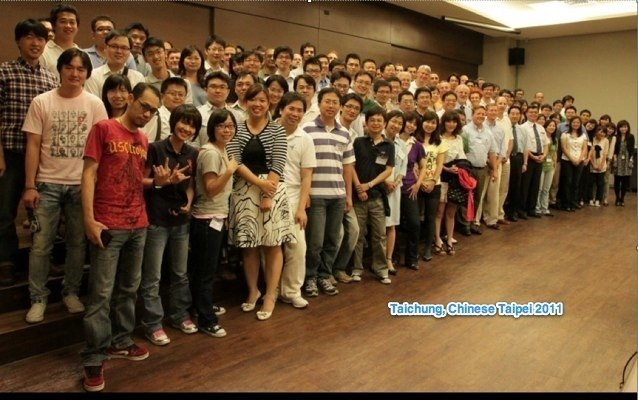
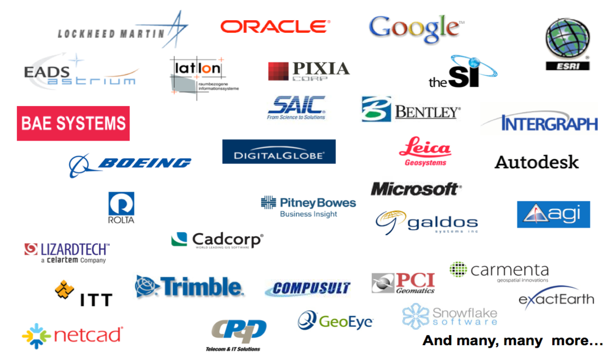
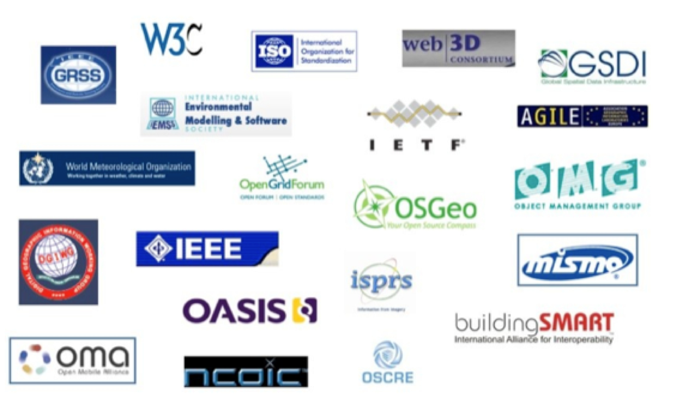
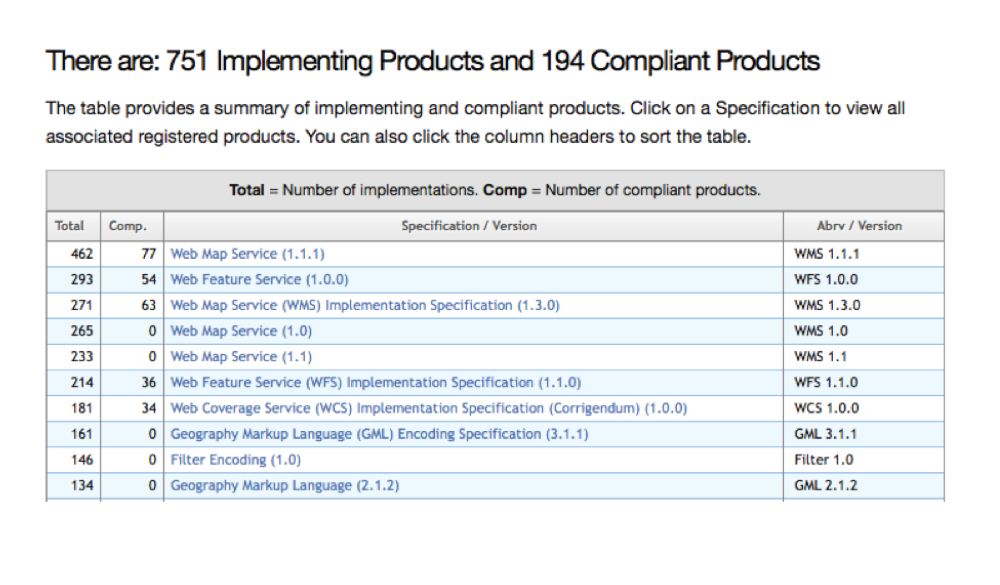
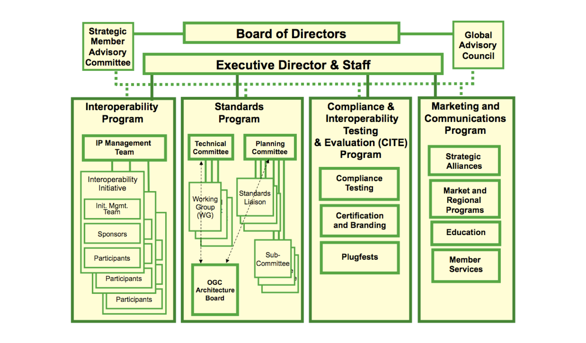

The OGC Overview
================

Open Geospatial Consortium
--------------------------

.. image:: ../img/ogc-logo.jpg
      :height: 327
      :width: 525
      :align: right
 
- Funded in 1994
- Voluntary consensus (470+ members)
- Standards organization (40+ standards)
- Leads the development of standards for geospatial and location based
  services.

Open Geospatial Consortium (OGC)
--------------------------------

**Mission**: To serve as a global forum for the collaboration of developers and users of spatial data products and services, and to advance the development of international standards for geospatial interoperability.

OGC in Policy Worldwide
-----------------------
- National level policy and legislation
- European INSPIRE Directive
- Global Earth Observation System of Systems (GEOSS) 
- European Space Agency
- Defense and Intelligence: NGA, NATO, ARMY ..
- Sub-national level: Delhi, Abu Dhabi, Western    

What does the OGC as an entity provides?
----------------------------------------
- An agreed upon **consensus process**
   - to encourage effectiveness and efficiency
   - for defining, testing, documenting, and approving specifications
- **Staff knowledge, expertise and support** to work with the members to facilitate the consensus process
- A comprehensive **communications infrastructure**
- A **consensus-based forum** for conflict resolution

Members
-------

http://www.opengeospatial.org/ogc/members/report/

.. image:: ../img/members_per.jpg
      :height: 700
      :width: 800
      
Membership levels
-----------------
- Strategic
- Principal
- Technical
- Associate  

Associate Membership
--------------------
- Voting Access to domain and standards working groups
- Receive 1 free registration to quarterly OGC Technical Committee meetings
- Access to the OGC Member Portal for all interested employees of the organization

Technical Membership
--------------------
- Associate Member Benefits +
- Voting participation in the OGC Technical Committee
- Receive 2 free meeting registrations to each of the quarterly OGC Technical Committee meetings
- Discounts on OGC compliance certification for their products.

          
Principal Membership Features
-----------------------------

- Broad access to OGC processes
- Voting participation in the OGC Technical Committee
- Voting participation in OGC Planning Committee
- Influence OGC market / domain direction
- Authority for OGC policies and procedures
- Approve OGC Board of Directors candidates
- Final approval for all OGC standards

Principal Membership Benefits
-----------------------------

- 24 hours / year OGC staff support
- Receive 4 free registrations to quarterly OGC Technical Committee meetings
- Significant Compliance certification discounts
- Can assign one Associate and two individual memberships to Organization partners / sub-contractors
- Elevated visibility in OGC marketing and communications

Strategic Membership
--------------------
- Principal Membership +  
- Voting participation in the OGC Strategic Member Advisory Committee 
- Receive 20 free meeting registrations to quarterly Technical Committee meetings 
- Receive up to 40 hours of OGC staff support each year for internal training and advice
- May assign up to 4 individual and 2 Associate one-year memberships to Organization partners / sub-contractors 
      
      
Industry Members
----------------

Strategic Members
-----------------
- Lockheed Martin
- US Geological Survey
- US Dept of Homeland Security
- National Aeronautics & Space Administration
- US National Geospatial-Intelligence Agency

Principal
---------
- Arizona State University
- BAE Systems – C3I Systems
- Bentley Systems
- Dept. of Science & Technology (India)
- EADS Astrium
- Esri
- Feng Chia University (Taiwan)

Principal
---------
- GIS Center for Security (UAE)
- Google
- Intergraph Corporation
- lat/lon GmbH
- Oracle USA
- Pixia Corp
- The SI Organization
- United Nations
- US National Oceanic and Atmospheric Administration

Example Government Members US
-----------------------------

- US DHS
- US DNI (PM/ISE)
- US EPA
- US FAA
- US NASA
- USGS / FGDC
- US NGA
- US NOAA
- Dept. of Land Conservation and Development (Oregon, USA)
- Oakridge National Lab

Example Government Members Europe
---------------------------------
- Eurocontrol
- European Environment Agency
- European Space Agency
- EU Joint Research Centre
- UK MET
- METEO France
- BRGM (France)
- Ordnance Survey (UK)
- State Land Agencies (Germany)
- City of Vienna (Austria)

Example Government Members Other Parts of the world
---------------------------------------------------
- Quebec Dept. of Natural Resources (Canada)
- DOD Australia
- Geoscience Australia
- Landgate (Western Australia)
- GIS Center for Security (Abu Dhabi, UAE) Abu Dhabi Systems & Info. Center
- Dubai Municipality
- Dept. Science & Technology (India)
- Ministerio de Bienes Nacionales - Secretaria Ejecutiva SNIT (Chile)

OGC Alliance Partners
---------------------

      
.. Geospatial Interoperability to dictionary is our mission and our expertise.  OGC has alliances with other major standards and professional organizations to assure that geospatial interoperability is consistently addressed across the broader IT community.  There is a growing body of internet standards that employ OGC standards (such as OGC Geography Markup Language) to consistently define  and address “location” across the internet and wireless.

Implementations
---------------

 
OGC Structure
-------------

        

   
