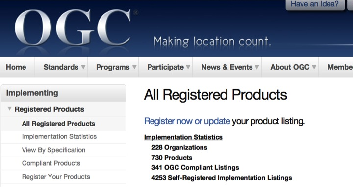
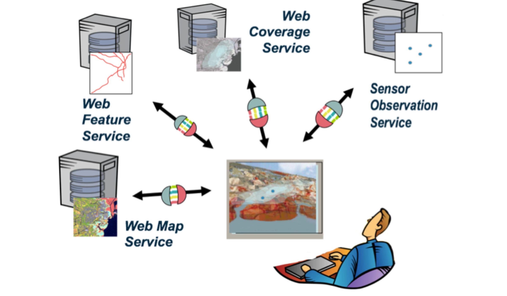

Open Geospatial Consortium
---------------------------

.. image:: ../img/ogc-logo.jpg
      :height: 327
      :width: 525
      :align: right
 
- Funded in 1994
- Voluntary consensus        
- Standards organization 
- Leads the development of standards for geospatial and location based services.

Open Geospatial Consortium (OGC)
----------------------------------

.. image:: ../img/ogc-people.jpg
      :height: 560
      :width: 900
      :align: left

**Mission**: To serve as a global forum for the collaboration of developers and users of spatial data products and services, and to advance the development of international standards for geospatial interoperability.

Open Geospatial Consortium (OGC)
-----------------------------------  

.. image:: ../img/members_per.jpg
      :height: 800
      :width: 1000
      
      
Members in America Latina
--------------------------

- Fundação CPqD  (Brazil) 
- Instituto Geográfico Agustín Codazzi (Colombia)
- Ministerio de Bienes Nacionales - Secretaria Ejecutiva SNIT (Chile)
- INFOCAM (México)     
- Instituto Nacional de Estadística y Geografíca INEGI (México)  
- CentroGeo (México)
- Universidad Autónoma del Estado de México (México)

Implementations
--------------------------

      
Collaboration
--------------------------

.. image:: ../img/sdos.jpg
      :height: 800
      :width: 1400
      
      
        
Services
--------------------------

      

      
      
        

   
