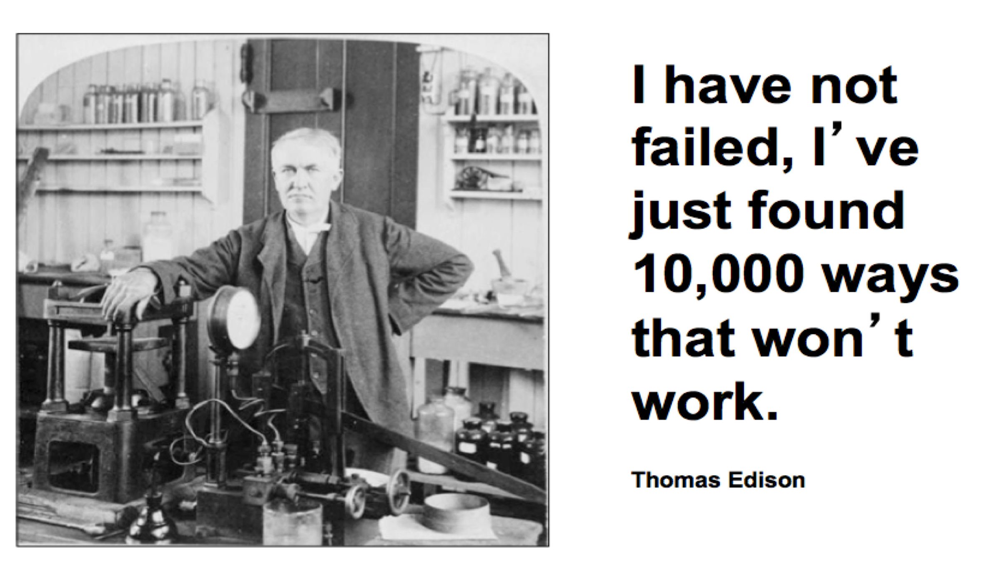
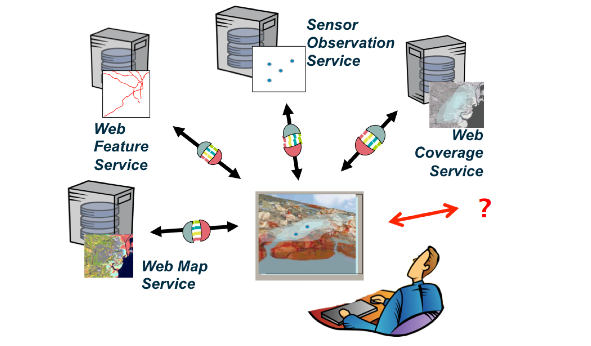
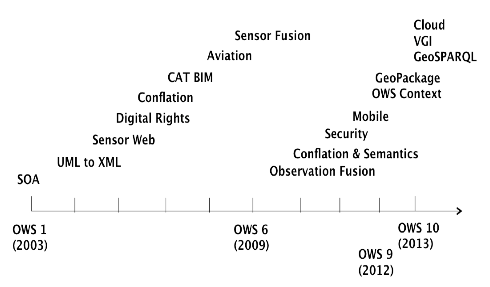
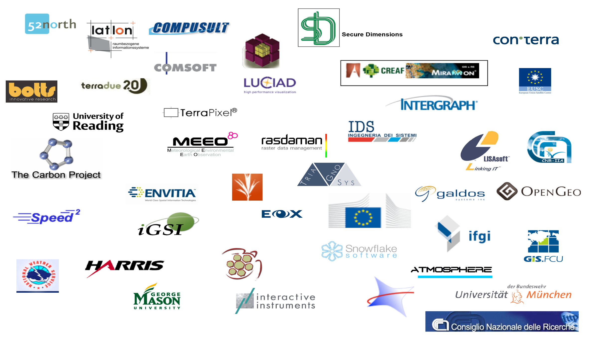

The OGC Interoperability Program (IP)
=====================================

How do we know if an idea works?
--------------------------------

      
Innovation about what?
----------------------

Innovation about what?
----------------------

      
Interoperability Program (IP)
-----------------------------

- A global, innovative, hands-on rapid prototyping and testing program
  designed to unite users and industry in accelerating interface development
  and validation, and the delivery of interoperability to the market.
- 70 initiatives since 1999
- Deliverables:
   - Technical Documents
   - Prototype Implementations
   - Demonstrations

Benefits of Involvement in IP Initiatives
-----------------------------------------

For Participants
    - Early insights and skill building
    - Early visibility
    - Early market deployment
    - Direct influence
    - Broaden market reach

Benefits of Involvement in IP Initiatives
-----------------------------------------
For Sponsors
    - Ability to Determine Market Interest
    - Accelerated process - workable interface specifications in 4-6 months
    - Vendors test, validate and demonstrate interface integrity – Rapid
      time to market
    - Leverage of other sponsor’ funding to solve common/similar problems
    - Significant ROI 2-3.5 overall (and as high as 25 for individual
      sponsors)

IP Type of activities
---------------------
- **Testbeds**: provide an environment for collaborative, fast-paced, multi-vendor
  rapid prototyping efforts to define, design, develop, and test candidate
  interface and encoding specifications.
- **Pilots**: apply and test OGC standards in real world applications using
  standards-based commercial off-the-shelf (SCOTS) products that implement OGC
  standards. Pilot Projects also help organizations identify gaps to be
  addressed by further standards development work.
- **Interoperability Experiments**
- **Concept Development Studies**
- **Plugest**

Testbed Activities
------------------

OWS-9 Testbed numbers
---------------------

- 55 organizations
- More than 200 individuals
- 60 components (Servers, Clients ..)
- 28 reports
- $2.85 Million
- Duration: less than year

OWS-9 Testbed Sponsors
----------------------
- US National Geospatial Intelligence Agency (NGA)
- US Geological Survey (USGS)
- US Army Geospatial Center (AGC)
- US Federal Aviation Administration (FAA)
- EUROCONTROL

OWS-9 Testbed Sponsors
----------------------
- US National Aeronautics & Space Administration (NASA)
- UK Defence Science & Technology Laboratory (DSTL)
- Lockheed Martin Corporation
- GeoConnections/Natural Resources Canada
- GeoViqua/CREAF/European Commission (EC)

OWS-9 Testbed Participants
--------------------------

