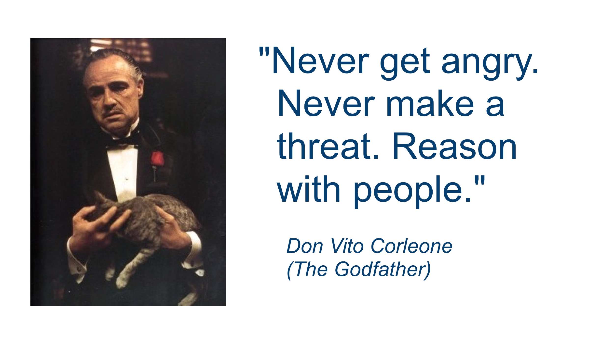
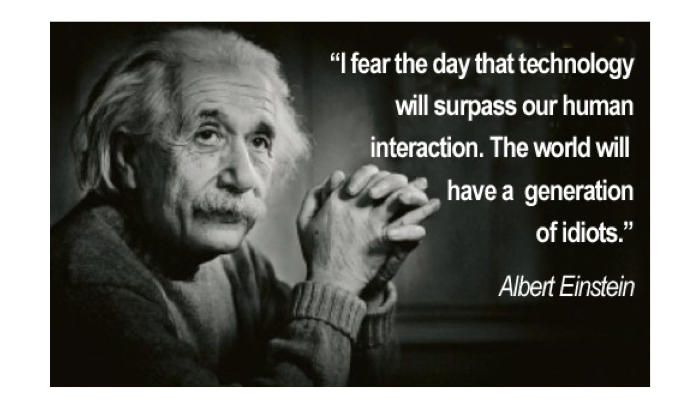

The OGC Standards Development Program
=====================================

It's all about coordinating people
----------------------------------
|
|
.. class:: big

   “Interoperability seems to be about the integration of information.  What it’s really about is the coordination of organizational behavior.”
|
    *David Schell, OGC Founder*

Standards Development Program
-----------------------------
- Consensus standards process similar to other Industry consortia (World Wide
  Web Consortium, OMA etc.).
- 33 “core” standards
- 15 extensions/profiles

What is a standard?
-------------------
- A **document**, established by **consensus** and **approved** by the OGC
  Membership, that provides rules and guidelines, aimed at the optimum degree
  of interoperability in a given context.
- Conveys:
   - Community requirements
   - Member requirements
   - Market trends
   - Technology trends

Standards List
--------------
http://www.opengeospatial.org/standards/is

.. image:: ../img/standards.jpg
      :height: 700
      :width: 1200 
      
      
Type of Specifications
----------------------
Implementation Specifications - Standards
   Basis for working software; detail the interface structure between software components
Abstract Specifications
   Conceptual foundation / reference model for specification development
Best Practices
   Describe use of specifications
Engineering Reports
   Results from the OGC Interoperability Program
Discussion Papers
   Forum for public review of concepts

What it takes
-------------

- Requires collaboration on a global basis
- Requires concensus by many organizations
- Requires give and take
- Requires certified, repeatable process

The Core of Consensus Philosophy
--------------------------------

Is Social
---------

.. OGC has 4 F2F meeting per year, Most WGS meet very week.

Consensus decision-making
-------------------------

**Is a group decision making process that seeks the consent of all participants. Consensus may be defined professionally as an acceptable resolution, one that can be supported, even if not the "favourite" of each individual.**

- This is what the OGC standards process is all about!
- Guided by the TC Policies and Procedures
- Also documented in the TAO: A Guide for New Members, the OGC New Member Orientation, and numerous other documents.
- Also guided by the OGC Principals of Conduct

Technical Committee
-------------------

- Where the formal standards development consensus discussion and approval process occurs.
- Comprised of a number of Domain Working Groups (DWGs or WGs for short) and Standards Working Groups (SWGs).
- Work guided by the Technical Committee Policies and Procedures

Domain Working Groups (DWGs)
----------------------------
Where Members discuss technical requirements, use cases, and issues related to the development and revision of OGC standards. The results of OGC interoperability projects are presented and discussed. Many Member presentations on the use of OGC standards.
Any Member or invited guest can attend any DWG session.

Standards Working Groups (SWGs)
-------------------------------

- Groups that work on a new (candidate) OGC standard or revision to an existing OGC standard
- Members only may participate
- Guided by the OGC Policies and Procedures
- OGC Intellectual Property policies in full effect
- Usually last from 6 months to 18 months

What is the OGC Planning Committee?
-----------------------------------
- The Planning Committee provides guidance and the management structure for the Technical Committee and the Interoperability Program.
- Members participate in OGC business planning and market focus activities
- Manages the consortium’s technology release process
- Approves special negotiated memberships and committee participation.
- Must be a Principal or Strategic Member or a TC representative to the PC to participate in PC activities.

What is the OGC Architecture Board (OAB)?
-----------------------------------------
- Work with the TC and the PC to insure architecture consistency of the Baseline and provide guidance to the OGC membership to insure strong life cycle management of the OGC standards baseline
- Reviews all OGC standards and revisions to standards prior to public comment.
- General technology discussions and guidance
- Evaluate candidate standards for fast track process
- Issue resolution
- Nominated and Elected by the OGC Membership

Domain Working Groups by Market
-------------------------------

- Aviation
- Business Intelligence and Decision Support
- Defence and Intelligence
- Earth System Science (ESS)
- Energy and Utilities
- Hydrology
- LandInfra
- Law Enforcement and Public Safety (LEAPS)
- Location Services and Mass Market Domain
- Met/Oceans

Domain Working Groups by Technology
-----------------------------------
- 3D
- Geosemantics
- Security
- Sensor Web Enablement (SWE)
- Workflow

