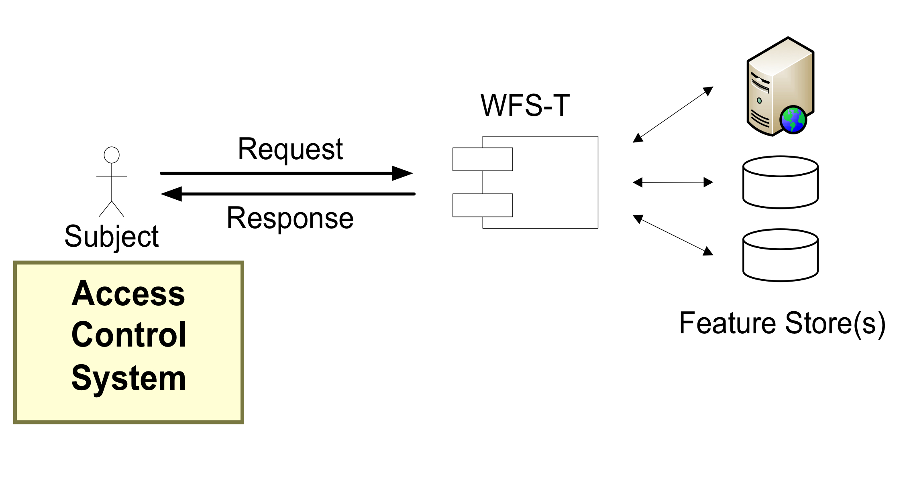

OGC  and Security
=================

Approach
--------

The OGC does not develop authentication, authorization and security standards.

The OGC defines best practices and extensions to existing standards from other standards organizations.

Extensions
----------

- XACML (OASIS): access control policy language in XML and a processing model to interpret the policies
- GeoXACML (OGC): geographic access control rules for distributed geographic content. 

OWS-8 AIXM Architecture
-----------------------

OWS-8 AIXM Architecture
-----------------------

- XACML based Access Control Systems support the enforcement of complex, fine grained rights 

- GeoXACML extension of XACML supports geometry and spatial functions

- Examples:
   
   - deny if user interacts with a service on IP 123.123.123.123
   - permit if Alice has activated role xyz and interacts with services of type WFS 2.0
   - permit if GetFeature requests refer to features of type   Runway within a certain area
   - permit if the request is a valid (de-)commissioning for features of type RadarSystem 

