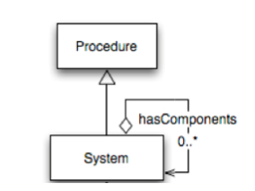
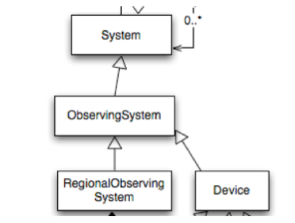
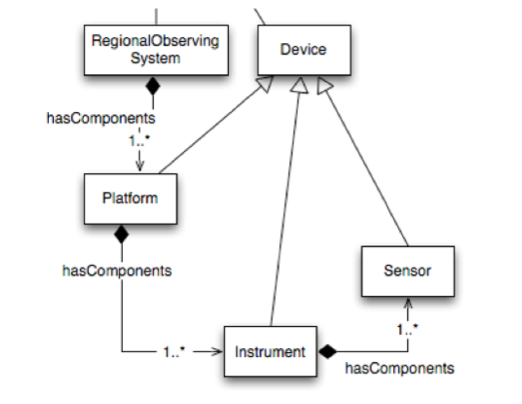
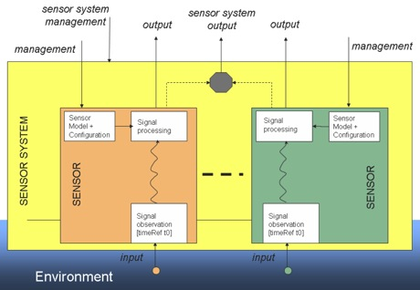
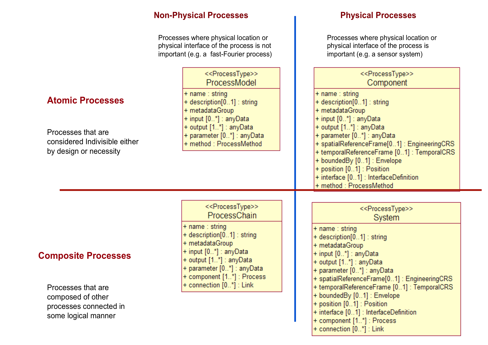

Sensor Model Language (SensorML)
================================

SensorML For Sensor Systems
----------------------------

Model to describe Sensor Systems:

- Detector
- Sensor
- Platform
- Observatories

SensorML can define systems
-----------------------------

Some types of environmental systems
-----------------------------------

Instrument composition
-----------------------

  

SensorML Instrument System
---------------------------

Sensor Web Enablement Architecture, `OGC-06-021r4 <http://portal.opengeospatial.org/files/?artifact_id=29405>`_

SensorML can describe a process
---------------------------------

Model to describe processes

- inputs
- output
- service chaining

SensorML Processes
--------------------

      
      
SensorML XML Example
----------------------
      
Lets walk through a SensorML example from `Geonovum <http://geostandards.geonovum.nl/index.php/5.3.3_SensorML>`_      
      
      
SensorML XML Keywords
-----------------------
.. code-block:: xml

   <keywords>
     <KeywordList>
       <keyword>weather station</keyword>
       <keyword>precipitation</keyword>
       <keyword>wind speed</keyword>
       <keyword>temperature</keyword>
     </KeywordList>
   </keywords>
        
SensorML XML Identification
----------------------------

.. code-block:: xml

   <identification>
     <IdentifierList>
       <identifier name="uniqueID">
         <Term definition="urn:ogc:def:identifier:OGC:uniqueID">
           <value>urn:ogc:object:feature:Sensor:IFGI:weatherStation123</value>
         </Term>
       </identifier>
       <identifier name="longName">
         <Term definition="urn:ogc:def:identifier:OGC:1.0:longName">
           <value>OSIRIS weather station 123 on top of the IfGI building</value>
         </Term>
       </identifier>
       <identifier name="shortName">
         <Term definition="urn:ogc:def:identifier:OGC:1.0:shortName">
           <value>OSIRIS Weather Station 123</value>
         </Term>
       </identifier>
     </IdentifierList>
   </identification>
              
SensorML XML Classification
----------------------------

.. code-block:: xml

   <classification>
     <ClassifierList>
       <classifier name="intendedApplication">
         <Term definition="urn:ogc:def:classifier:OGC:1.0:application">
           <value>weather</value>
         </Term>
       </classifier>
     </ClassifierList>
   </classification>
   
SensorML XML Valid Time
------------------------
  
.. code-block:: xml

   <validTime>
     <gml:TimePeriod>
       <gml:beginPosition>2009-01-15</gml:beginPosition>
       <gml:endPosition>2009-01-20</gml:endPosition>
     </gml:TimePeriod>
   </validTime>   
   
SensorML XML Capabilities
-------------------------
  
.. code-block:: xml  

   <capabilities>
     <swe:DataRecord definition="urn:ogc:def:property:capabilities">
       <swe:field name="status">
         <swe:Text definition="urn:ogc:def:property:OGC:1.0:status">
           <gml:description>The operating status of the system.</gml:description>
           <!-- station is active -->
           <swe:value>active</swe:value>
         </swe:Text>
       </swe:field>
       <!-- Area that is observed by the station. In this case is insitu
        It matches the location of the station.  -->
       <swe:field name="observedBBOX">
         <swe:Envelope definition="urn:ogc:def:property:OGC:1.0:observedBBOX">
           <swe:lowerCorner>
             <swe:Vector>
               <swe:coordinate name="easting">
                 <swe:Quantity axisID="x">
                   <swe:uom code="m"/>
                   <swe:value>2592308.332</swe:value>
                 </swe:Quantity>
               </swe:coordinate>
               <swe:coordinate name="northing">
                 <swe:Quantity axisID="y">
                   <swe:uom code="m"/>
                   <swe:value>5659592.542</swe:value>
                 </swe:Quantity>
               </swe:coordinate>
             </swe:Vector>
           </swe:lowerCorner>
           <swe:upperCorner>
             <swe:Vector>
               <swe:coordinate name="easting">
                 <swe:Quantity axisID="x">
                   <swe:uom code="m"/>
                   <swe:value>2592308.332</swe:value>
                 </swe:Quantity>
               </swe:coordinate>
               <swe:coordinate name="northing">
                 <swe:Quantity axisID="y">
                   <swe:uom code="m"/>
                   <swe:value>5659592.542</swe:value>
                 </swe:Quantity>
               </swe:coordinate>
             </swe:Vector>
           </swe:upperCorner>
         </swe:Envelope>
       </swe:field>
     </swe:DataRecord>
   </capabilities>
   
SensorML XML Contact
---------------------

.. code-block:: xml  

   <contact>
     <ResponsibleParty gml:id="WWU_IfGI_weather_station_contact">
       <organizationName>Westfälische Wilhelms-Universität Münster - Sensor Web and Simulation Lab</organizationName>
       <contactInfo>
         <address>
           <electronicMailAddress>swsl-ifgi@listserv.uni-muenster.de</electronicMailAddress>
         </address>
       </contactInfo>
     </ResponsibleParty>
   </contact>
   
SensorML Position
------------------
  
.. code-block:: xml  

   <position name="systemPosition">
     <swe:Position referenceFrame="urn:ogc:def:crs:EPSG:6.14:31466">
       <swe:location>
         <swe:Vector gml:id="SYSTEM_LOCATION">
           <swe:coordinate name="easting">
             <swe:Quantity axisID="x">
               <swe:uom code="m"/>
               <swe:value>2592308.332</swe:value>
             </swe:Quantity>
           </swe:coordinate>
           <swe:coordinate name="northing">
             <swe:Quantity axisID="y">
               <swe:uom code="m"/>
               <swe:value>5659592.542</swe:value>
             </swe:Quantity>
           </swe:coordinate>
           <swe:coordinate name="altitude">
             <swe:Quantity axisID="z">
               <swe:uom code="m"/>
               <swe:value>297.0</swe:value>
             </swe:Quantity>
           </swe:coordinate>
         </swe:Vector>
       </swe:location>
     </swe:Position>
   </position>

SensorML Inputs
----------------
  
.. code-block:: xml  

   <inputs>
     <InputList>
       <input name="precipitation">
         <swe:ObservableProperty definition="urn:ogc:def:property:OGC:1.0:precipitation"/>
       </input>
       <input name="wind">
         <swe:ObservableProperty definition="urn:ogc:def:property:OGC:1.0:wind"/>
       </input>
       <input name="atmosphericTemperature">
         <swe:ObservableProperty definition="urn:ogc:def:property:OGC:1.0:temperature"/>
       </input>
     </InputList>
   </inputs>

SensorML Outputs
-----------------
  
.. code-block:: xml 

   <outputs>
     <OutputList>
       <output name="precipitation">
         <swe:Quantity definition="urn:ogc:def:property:OGC:1.0:precipitation">
           <swe:uom code="mm"/>
         </swe:Quantity>
       </output>
       <output name="windDirection">
         <swe:Quantity definition="urn:ogc:def:property:OGC:1.0:windDirection">
           <swe:uom code="deg"/>
         </swe:Quantity>
       </output>
       <output name="windSpeed">
         <swe:Quantity definition="urn:ogc:def:property:OGC:1.0:windSpeed">
           <swe:uom code="m/s"/>
         </swe:Quantity>
       </output>
       <output name="temperature">
         <swe:Quantity definition="urn:ogc:def:property:OGC:1.0:temperature">
           <swe:uom code="Cel"/>
         </swe:Quantity>
       </output>
     </OutputList>
   </outputs> 

SensorML Components
--------------------
  
.. code-block:: xml  

   <components>
     <ComponentList>
       <component name="rainGauge" xlink:href="http://mySensorMLregistry.com?object=98765"/>
       <component name="anemoneter" xlink:href="http://mySensorMLregistry.com?object=33333"/>
       <component name="thermometer">
         <Component>
           ...
         </Component>
       </component>
     </ComponentList>
   </components>

SensorML Component
----------------------------
  
.. code-block:: xml  

   <!-- similar to System, Contact and Position Information are inherited -->
   <Component>
     <keywords>
       ...
     </keywords>
     <identification>
       <IdentifierList>
         <identifier name="uniqueID">
           <Term definition="urn:ogc:def:identifier:OGC:uniqueID">
             <value>urn:ogc:object:feature:Sensor:IFGI:thermometer123</value>
           </Term>
         </identifier>
         <identifier name="longName">
           <Term definition="urn:ogc:def:identifier:OGC:1.0:longName">
             <value>OSIRIS Thermometer at weather station 123</value>
           </Term>
         </identifier>
         <identifier name="shortName">
           <Term definition="urn:ogc:def:identifier:OGC:1.0:shortName">
             <value>OSIRIS Thermometer 123</value>
           </Term>
         </identifier>
       </IdentifierList>
     </identification>
     <classification>
       <ClassifierList>
         <classifier name="sensorType">
           <Term definition="urn:ogc:def:classifier:OGC:1.0:sensorType">
             <value>thermometer</value>
           </Term>
         </classifier>
       </ClassifierList>
     </classification>
     <capabilities>
       <swe:DataRecord definition="urn:ogc:def:property:capabilities">
         <swe:field name="status">
           <swe:Text definition="urn:ogc:def:property:OGC:1.0:status">
             <gml:description>The operating status of the system.</gml:description>
             <swe:value>active</swe:value>
           </swe:Text>
         </swe:field>
       </swe:DataRecord> 
     </capabilities>
     <inputs>
       <InputList>
         <input name="atmosphericTemperature">
           <swe:ObservableProperty definition="urn:ogc:def:property:OGC:1.0:temperature"/>
         </input>
       </InputList>
     </inputs>
     <outputs>
       <OutputList>
         <output name="temperature">
           <swe:Quantity definition="urn:ogc:def:property:OGC:1.0:temperature">
             <gml:groupName codeSpace="ObservationOffering"> Weather </gml:groupName>
             <swe:uom code="Cel"/>
           </swe:Quantity>
         </output>
       </OutputList>
     </outputs>
   </Component>
