TEAM Engine Tutorial
####################

:author: Luis Bermudez <lbermudez@opengeospatial.org>, Richard Martell
:version: 4.0.3
:date: November 21, 2013
:questions: http://cite.opengeospatial.org/forum

.. contents::

.. footer::

  .. class:: right

    Page ###Page###

.. section-numbering::

.. raw:: pdf
   
   PageBreak oneColumn

Introduction
************

The Test, Evaluation, And Measurement (TEAM) Engine is a test harness that executes
test suites written using the OGC CTL test grammar or the TestNG framework.
It is typically used to verify specification compliance and is the official test harness of
the OGC Compliance Testing Program (CITE), where it is used to certify implementations of
OGC and ISO geomatics standards.

OGC hosts an official stable deployment of TEAM Engine with the approved test suites:
http://cite.opengeospatial.org/teamengine/

OGC also hosts a Beta TEAM Engine with the tests in Beta and  with new TEAM Engine functionality:
http://cite.opengeospatial.org/te2

Prerequisites and Needed Tools
******************************

To Build TEAM Engine and the OGC Tests you need the following:

- JAVA 1.7 or later http://www.java.com/en/
- MAVEN 3.0  http://maven.apache.org
- An SVN client
- Tomcat 7.0 http://tomcat.apache.org
- A text editor to open configuration files in XML.

In this tutorial the Eclipse tool will be used to checkout the code and build the maven project.

Java
====
Download JAVA 1.7 JDK (Java Development Kit) from the `Oracle Web site <http://www.java.com>`_

Download and Install Eclipse
============================
Download Eclipse from to `download site <http://www.eclipse.org/downloads/>`_. This tutorial uses version 4.2 (Juno).

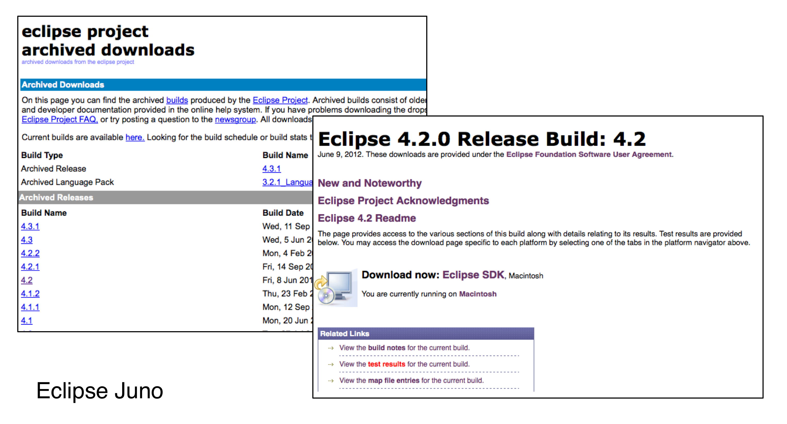
     
     
Install Elcipse  SVN and Maven Plugins for Eclipse
==================================================
To allow Eclipse to checkout SVN projects and run MAVEN commands it is required to download Eclipse plugins. For
SVN `Subersive <http://www.eclipse.org/subversive/installation-instructions.php>`_  for maven `M2E <http://www.eclipse.org/m2e/>`_.

- Run Eclipse and select **Help > Install New Software**... from the main menu.

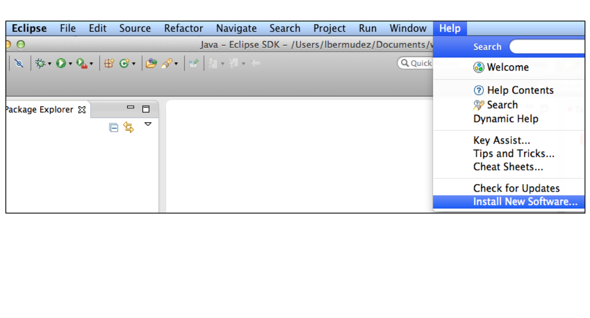

- Select **"Juno - http://download.eclipse.org/releases/juno"** and expand the **Collaboration** group.

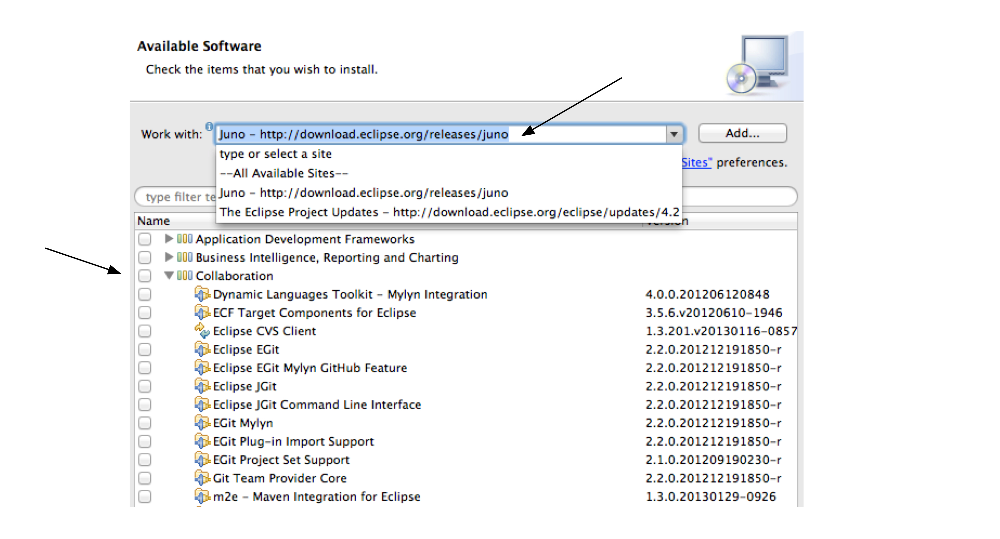

- In the **Collaboration** group  select plugins:

   * m2e - Maven integration in Eclipse
   * Subversion SVN Team Provider
   * Subversion SVN Team Provider Sources

- Verify that it looks like the following:

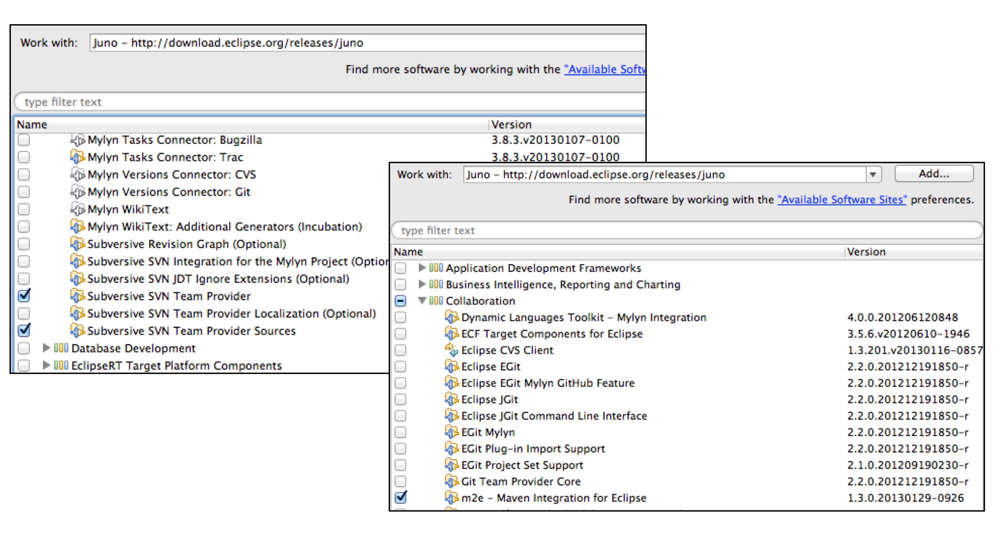

-  Click next and accept license agreements. You will be prompted to restart Eclipse.

- When Eclipse is started the **Install Connectors** window will appear. Select SVN **Kit 1.7.8**

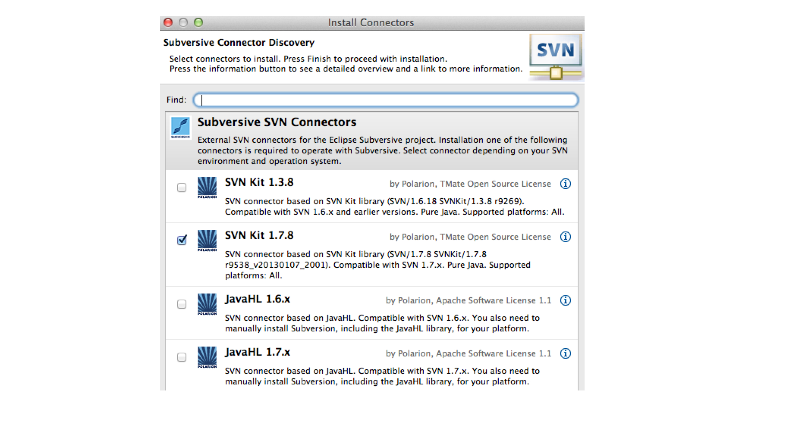

- Install the connectors

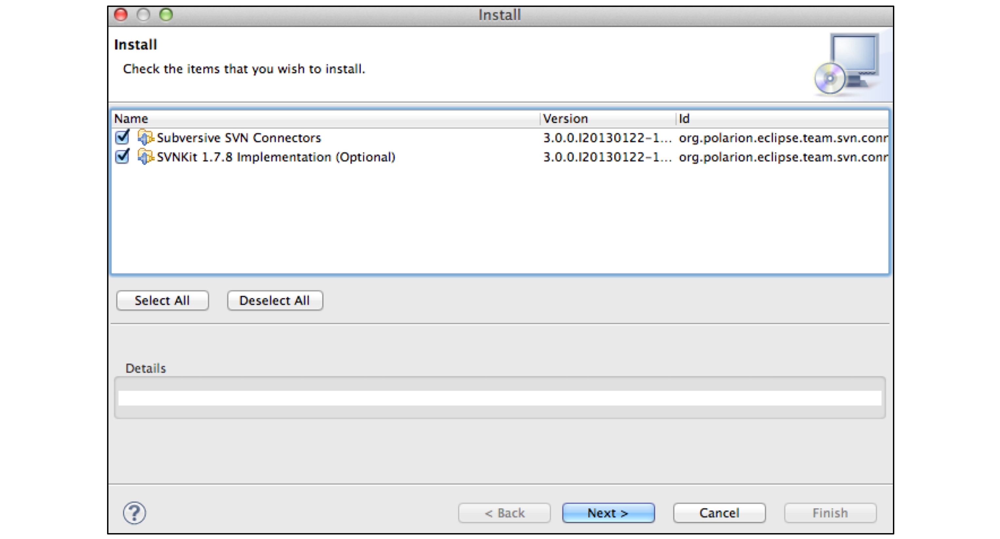

- Click next and accept license agreements. You will be prompted to restart Eclipse.

Downloading TEAM Engine Source code
***********************************

Connect to Repository
=====================

In the Eclipse Main Menu go to the **Window** Menu and select **Show View** and then **Other**. Expand *SVN* and select **SVN Repositories**

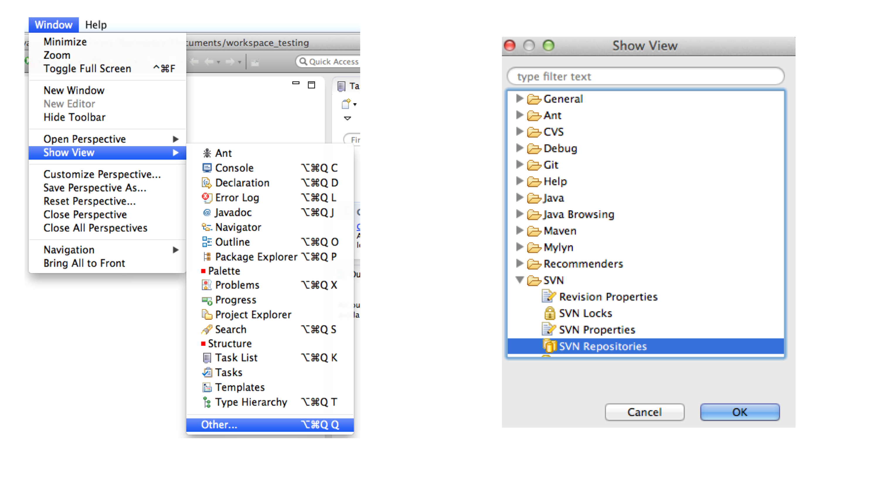
     
TEAMEngine is at the sourceforge repository:

https://svn.code.sf.net/p/teamengine/code

To download a particular tag type: https://svn.code.sf.net/p/teamengine/code/tags/4.0.3

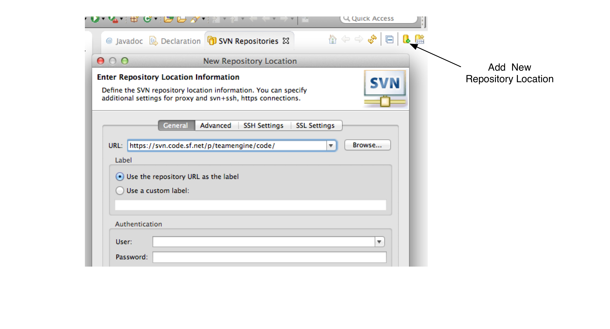

The repository contains three main folders:

- **branches** used for special development tasks, fix bugs, test new features, etc.
- **tags** used to register releases, alpha, beta, and production. The production releases don't say "beta" nor "alpha"
- **trunk** is where the unstable development occurs.

Checkout as a Maven project
===========================

Install the Maven SVN connector
-------------------------------

Try checking out as Maven from SCM

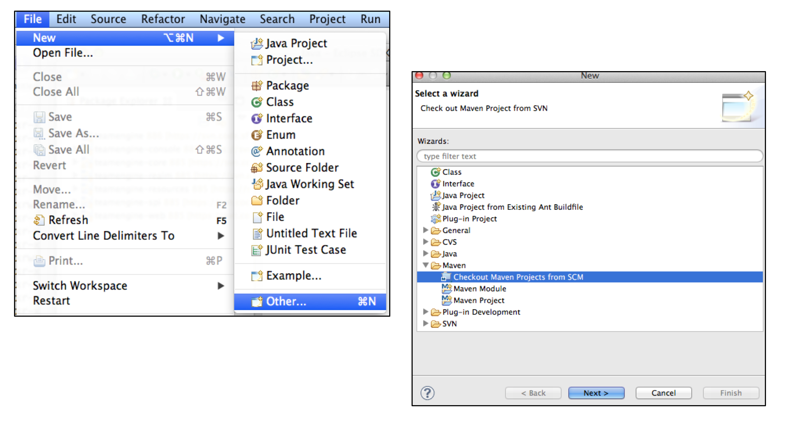

The first time you checkout a MAVEN project from SVN you will be prompted to get a connector

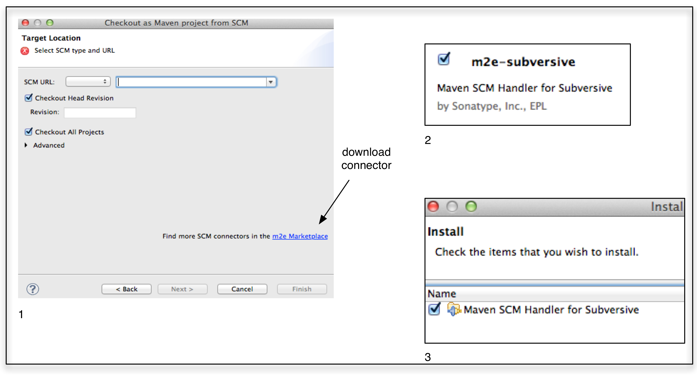
        
* Click on **m2e Marketplace**, select **m2e-subversive**  and click **Finish**.
* The select **Maven SCM Handler for Suberversive**
* Click next and accept license agreements. You will be prompted to restart Eclipse.

Select the version of TEAM ENgine that you want to download
-----------------------------------------------------------

Copy the URL of the tag. For example::
 
   https://svn.code.sf.net/p/teamengine/code/tags/4.0.3

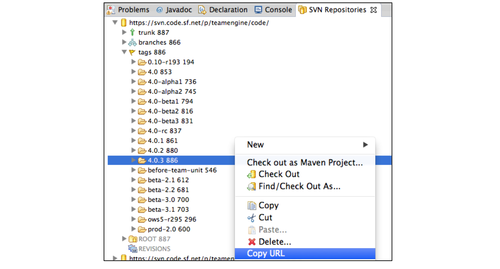

Checkout as Maven project
-------------------------

Go to **New** / **Other** / **Checkout MAVEN projects from SVN**

     
Paste the URL that you previously selected. For example::
 
   https://svn.code.sf.net/p/teamengine/code/tags/4.0.3

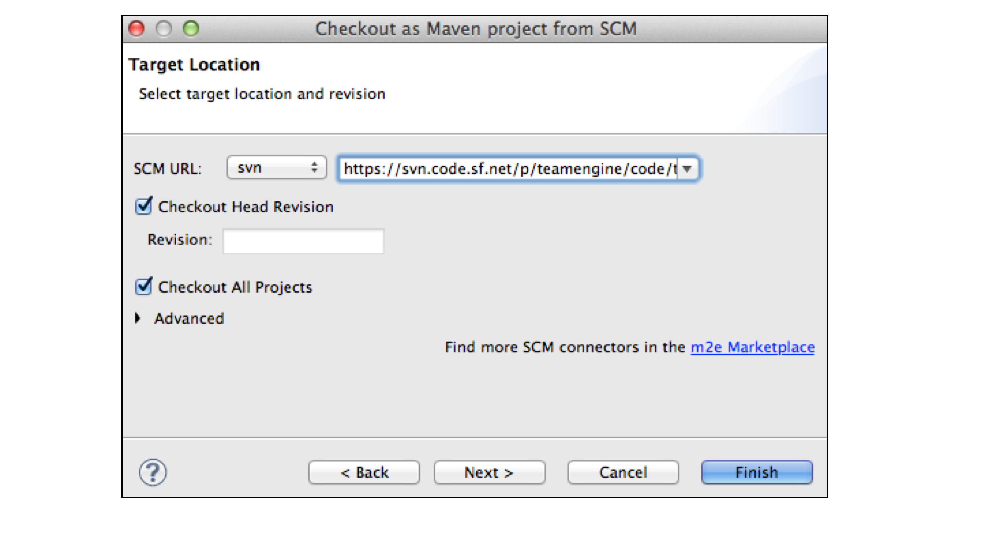
     
Understanding the source
========================

When checking out, Eclipse creates 7 projects. Every module is presented as a project. The TEAM Engine project
contains the 6 other modules.
There is an extra folder **src** where basic documentation is available.

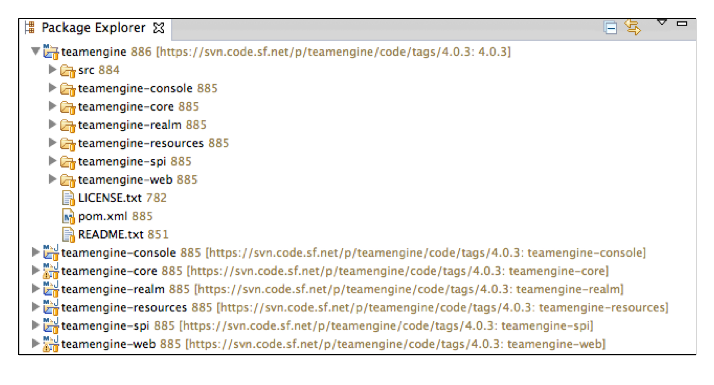

Each module is composed of the following:

- teamengine-core: Main CTL script processor
- teamengine-resources: Includes shared resources such as stylesheets and schemas
- teamengine-spi: Provides an extensibility framework and a REST-like API for test execution
- teamengine-realm: A custom Tomcat user realm
- teamengine-web: A web application for executing test suites and browsing test results
- teamengine-console: A console application that provides a command-line interface for executing test suites in Unix and Windows environments.

Building TEAM Engine Source Code
********************************

Build the code with MAVEN
=========================
Execute maven build command from the root of the source code::

   cd .../teamengine 
   mvn clean install
   
Can also build via Eclipse, doing right click on the main pom, or the main folder ``teamengine``.

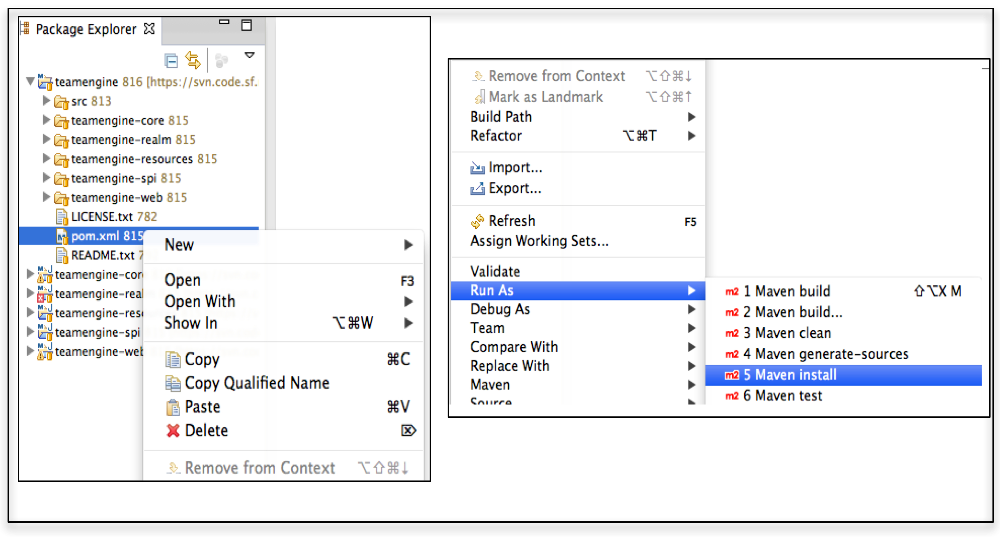
     
A successful build should have a **BUILD SUCCESS** message, similar to the following::

   [INFO] Relativizing decoration links with respect to project URL: http://sourceforge.net/projects/teamengine/
   [INFO] Rendering site with org.apache.maven.skins:maven-fluido-skin:jar:1.3.0 skin.
   [INFO] 
   [INFO] --- maven-pdf-plugin:1.2:pdf (pdf) @ teamengine-web ---
   [INFO] Skipped report generation.
   [INFO] ------------------------------------------------------------------------
   [INFO] Reactor Summary:
   [INFO] 
   [INFO] TEAM Engine ....................................... SUCCESS [15.912s]
   [INFO] TEAM Engine - Tomcat Realm ........................ SUCCESS [0.617s]
   [INFO] TEAM Engine - Shared Resources .................... SUCCESS [0.317s]
   [INFO] TEAM Engine - Service Providers ................... SUCCESS [0.901s]
   [INFO] TEAM Engine - Core Module ......................... SUCCESS [0.666s]
   [INFO] TEAM Engine - Web Module .......................... SUCCESS [0.731s]
   [INFO] ------------------------------------------------------------------------
   [INFO] BUILD SUCCESS
   [INFO] ------------------------------------------------------------------------
   [INFO] Total time: 20.151s
   [INFO] Finished at: Wed Apr 17 06:42:15 EDT 2013
   [INFO] Final Memory: 20M/81M
   [INFO] ------------------------------------------------------------------------
     

Discovering the created artifacts
=================================

After building MAVEN, artifacts are created in the target folders. The zip files
created under ``teamengine-core`` will be used to setup and configure TEAM Engine.

.. image:: ../img/aftermvnbuild.jpg
     :width: 10in   
     
The main build artifacts are listed below.

**teamengine-console-4.0.3-bin.[zip|tar.gz]**
   Archive containing the console application (command-line usage)

**teamengine-console-4.0.3-base.[zip|tar.gz]**
   Archive containing the initial contents of the main configuration directory (TE_BASE)

**teamengine.war**
   The JEE (Servlet) web application

**teamengine-common-libs.[zip|tar.gz]**
   Archive containing common runtime dependencies (e.g. JAX-RS 1.1, Apache Derby)

Setting up and Running TEAM Engine
**********************************

Configure TE_BASE
=================

The value of the TE_BASE system property or environment variable
specifies the location of the main configuration directory that
contains several essential sub-directories.

The structure of the TE_BASE configuration directory was created in the **teamengine-console-4.0.3-base.zip**
when the code was built with MAVEN.
It can be found under the **teamengine-console/target** directory.

Understand TE_BASE
==================
TE_Base structure is as follows:: 

   TE_BASE
     |-- config.xml   # main configuration file
     |-- resources/   # shared test suite resources
     |-- scripts/     # CTL test scripts
     |-- work/        # teamengine work directory 
     +-- users/       # user account details and test run outputs
        |-- {user1}/
        |-- {user2}/
        +-- ...
        
Locate a simple ctl Test
========================

TE_BASE comes with a simple ctl script, **note.ctl**. It is located under the scripts directory::
 
   |-- scripts/ 
      note.ctl 
 
        
Prepare TEAM Engine console
===========================

When running **MAVEN install** the file ``teamengine-console-4.0.3-bin.zip`` was created under the **teamengine-console/target**.

Copy the file and uzip it in another place

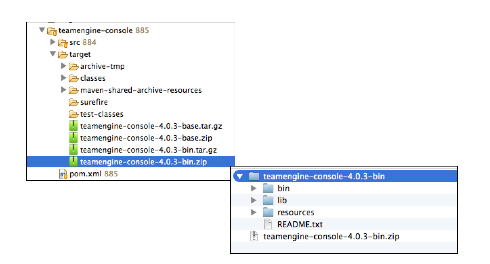

After unzipping the directory should look like the following::

   teamengine-console-4.0.3-bin
     |-- bin/  # shell scripts (windows, unix)
       |-- unix
       |-- windows
     |-- lib/   # supporting libraries
     |-- resources/ # classpath resources (stylesheets, schemas, etc.)
     
Configure PATHS in setenv
=========================

The **teamengine-console-4.0.3-base.zip** can be unzipped anywhere, however it is important to setup the system property or
 environment variable.

For MAC/UNIX go to the **bin** folder under **teamengine-console-4.0.3-bin** and edit
 the setenv.sh, by providing the value to TE_BASE directory. For example:::
   export TE_BASE=/Users/lbermudez/Documents/test/teamengine-console-4.0.3-base

For Windows go to **windows** and edit **setenv.bat**::
   set TE_BASE=%USERPROFILE%\teamengine
 
Run TEAM Engine via command line
================================

Go the bin folder and select either unix or windows  to run test command: ``unix/test.sh`` or ``windows/test.bat``.

To run the command it is necessary to provide a parameter ``-source``. For example::
  
   ./test.sh -source=note.ctl
        
If the TEAM Engine has properly being installed a pop-up window should appear with information about the test. Clicking on **Start** will start the test. The test should failed and the terminal should provide the following:

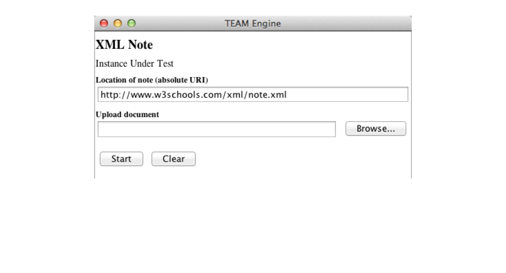

The command prompt should show a message like the following::
  
         Testing note:main type Mandatory in Test Mode with defaultResult Pass (s0003)...
               Assertion: The note is valid.
         Testing note:check-heading type Mandatory in Test Mode with defaultResult Pass (s0003/d1e97_1)...
                  Assertion: The heading contains more than whitespace.
               Test note:check-heading Passed
         Testing note:check-user type Mandatory in Test Mode with defaultResult Pass (s0003/d1e102_1)...
                  Assertion: The 'to' user is valid.
               Test note:check-user Passed
         Testing note:check-user type Mandatory in Test Mode with defaultResult Pass (s0003/d1e107_1)...
                  Assertion: The 'from' user is valid.
               Test note:check-user Failed
            Test note:main Failed

Building OGC Tests Scripts
**************************

Understanding  OGC Tests Structure
==================================

OGC Tests can be written either in  CTL (Compliance Test Language) or TestNG. Tests are located at the
public OGC SVN Repository:

CTL tests are located at https://svn.opengeospatial.org/ogc-projects/cite/scripts/
TestNG test are located at https://svn.opengeospatial.org/ogc-projects/cite/ets

CTL tests structure
-------------------

The CTL tests are structured as follows:

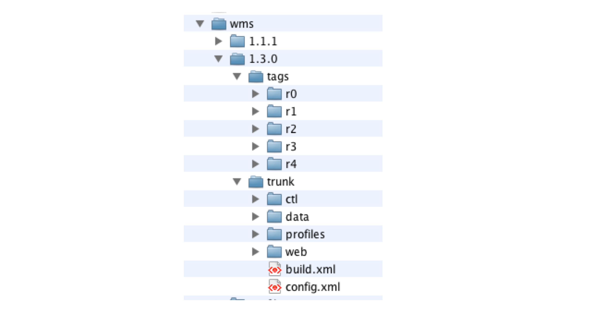

The **trunk** contains the latest version. The folder **tags** contains the revisions deployed in the testing web sites.

TestNG tests structure
----------------------
The TestNG tests are structured as follows:

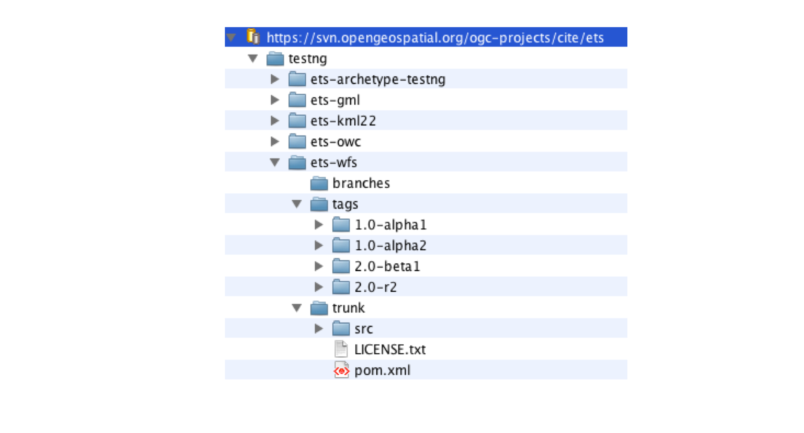

The **trunk** contains the latest version. The folder **tags** contains the revisions deployed in the testing web sites.
The TestNG tests also follows a MAVEN structure.

Configuring  CTL Tests in TEAM Engine
=====================================

To make available the OGC CTL Tests in TEAM Engine, the tests need to be placed at the TE_BASE/scripts
and the TE_BASE/config.xml file needs to be updated accordingly.

Copy CTL Tests in TE_BASE/scripts
---------------------------------

As a convenience, the shell script ``export-ctl`` may be run to export CTL test suites from the official OGC repository.
The location of a CSV file is passed as the first argument to the script.
Each record in the file should contain two fields: a Subversion URL, and a local path name relative to TE_BASE/scripts.

- Download the ``ctl-scripts-release.csv`` file::
   https://svn.opengeospatial.org/ogc-projects/cite/ets/ets-resources/tags/13.11.14/src/main/config/ctl-scripts-release.csv
- Copy it to **TE_BASE/bin/unix** or **TE_BASE/bin/windows**
- Open a terminal window
- Setup or Export the environment variable TE_BASE
   - UNIX:: 
      $ export TE_BASE=/some/path
      
   - Windows:: 
      ...   
- Run the following command to populate the ``TE_BASE/scripts`` directory with these test suites::
      $ ./export-ctl.sh ctl-suites-dev.csv

After running the command the TE_BASE should look like the following:

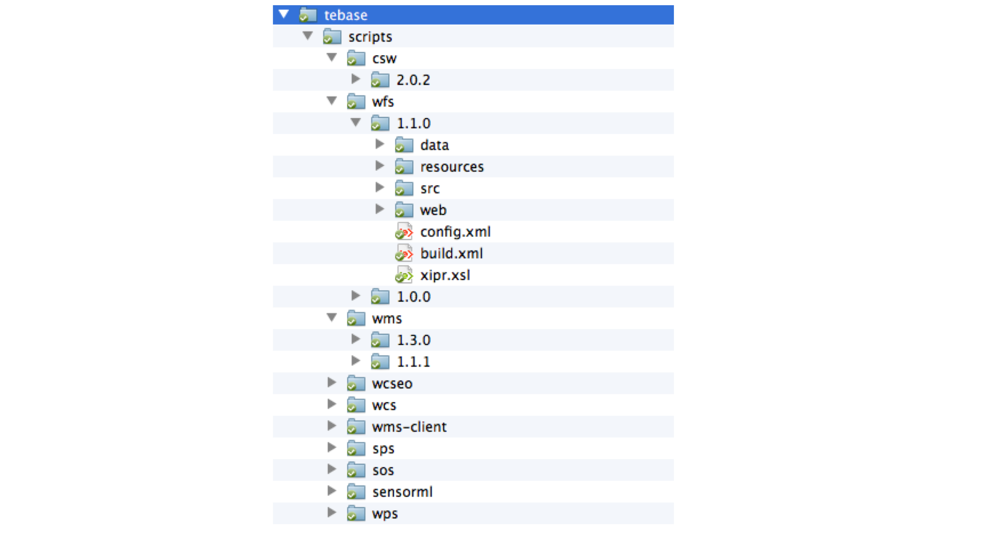
     

Note: that the folder of the test structure looks like the trunk structure.

Once the tests are properly installed in the TE_BASE, it is possible to run OGC test suites. For example::

   ./test.sh -source=csw/2.0.2/src/main.xml 
   

Update config.xml
-----------------

The ``TE_BASE/config.xml`` is used as the "registry" to let know TEAM Engine what are the test that are available.
This file should be placed under the TE_BASE folder.

**config.xml** contains the name of the test (sos), the revision (r9) and the local path to the source of the tests (sos/1.0.0/ctl)::

      <organization>
        <name>OGC</name>
        <standard>
          <name>Sensor Observation Service (SOS)</name>
          <version>
            <name>1.0.0</name>
            <suite>
              <namespace-uri>http://www.opengis.net/sos/1.0</namespace-uri>
              <prefix>sos</prefix>
              <local-name>suite</local-name>
              <title>SOS 1.0 Conformance Test Suite</title>
              <description>Checks service implementations for conformance to OGC 06-009r6.</description>
            </suite>
            <revision>
              <name>r9</name>
              <sources>
                <source>sos/1.0.0/ctl</source>
              </sources>
              <resources>sos/1.0.0/resources</resources>
              <webdir>sos/1.0.0/web</webdir>
            </revision>
          </version>
        </standard>
      </organization>
      
The config file for TE release 4.0.3 for the approved tests can be found `here <https://svn.opengeospatial.org/ogc-projects/cite/ets/ets-resources/tags/13.11.14/src/main/config/teamengine/config-approved.xml>`_

The config file for TE release 4.0.3 for all the tests, including the ones in beta can be found `here <https://svn.opengeospatial.org/ogc-projects/cite/ets/ets-resources/tags/13.11.14/src/main/config/teamengine/config.xml>`_

The local path can be used to exercise the test via command line::

   ./test.sh -source=sos/1.0.0/ctl
   

Building and Copying TestNG Tests in TE_BASE and TEAM Engine
============================================================

Access the code repository
--------------------------

#. Go to: Window / Show View / Other.
#. Expand SVN
#. Select **SVN Repositories**
#. In the SVN Repositories View, right click and select New / Repository Location
#. Write the following location in the URL::
    https://svn.opengeospatial.org/ogc-projects/cite/ets
#. Do not need to write user and password. If the authentication window appears. Select cancel.
#. Three main folders should be available: **ets-resources**, **testng** and **utils**

The SVN Repositories view should look as follows

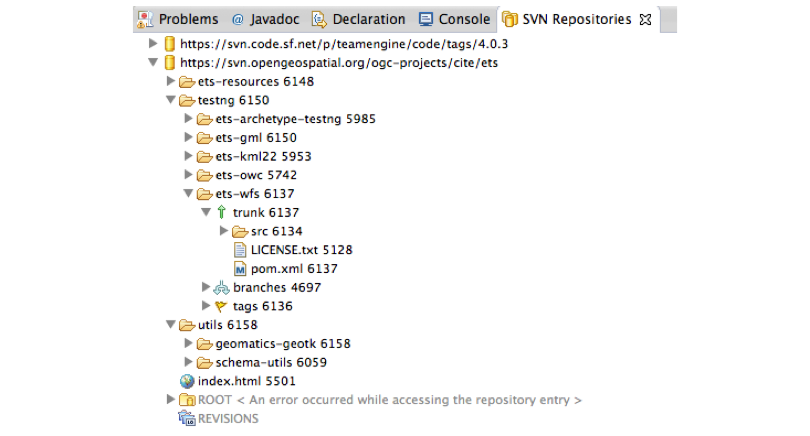

Checkout a test from the  code repository
-----------------------------------------

- Select a test revision (a tag or trunk) to build.
- Right click and Checkout as Maven project. For example if selecting revision r12 **SVN Repositories** window and menu should like like the following:

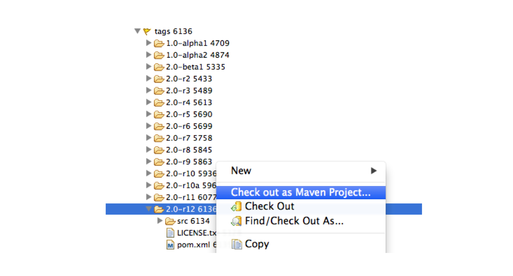

- After the checkout is succesfull the **Project Explorer** window should show the different tests as projects.
- You may need to rename the project name if you are downloading more than one revision.

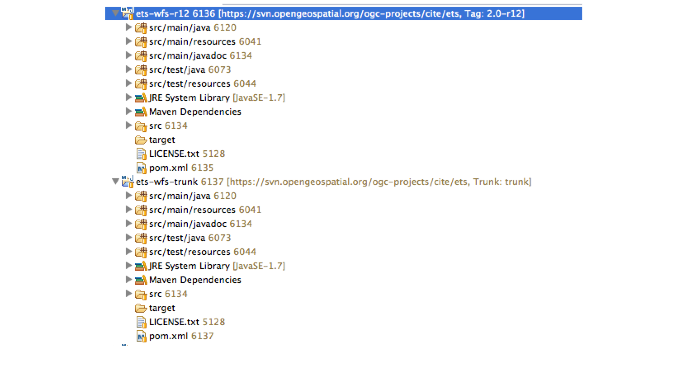

The project name was **ets-wfs** and it was rename to **ets-wfs-r12**.

Build the Tests with MAVEN
--------------------------
- Right click on the project folder (e.g. **ets-wfs-r12**)
-  Select **Run As** / **Maven Install**. The MAVEN run will create a target folder with the builds.
- Unzip the file that has the libraries (.jar) and dependencies. The file name ends with **...deps.zip**. For example for KML2.2 the file created is **ets-kml22-2.2-r6-deps**.
- Copy the libraries under lib directory of TE_BASE

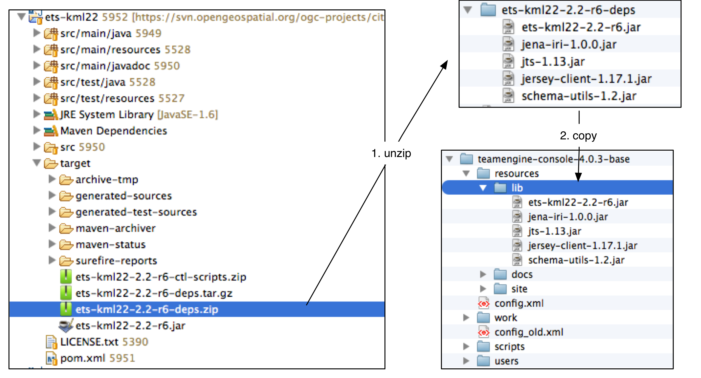

- Unzip the file which name ends with **ctl-scripts.zip**
- Copy the directory under the TE_BASE/scripts.

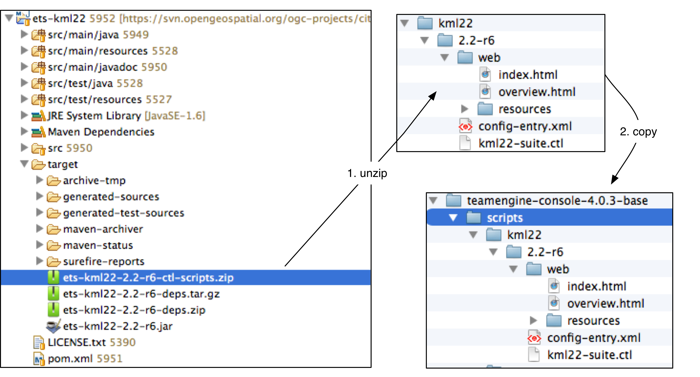

Building a web application with OGC tests (needs update)
********************************************************

Install war
===========

When builduing TEAM Engine code doing (mvn install), various files under ``target`` were created. Under the folder ``teamengine-web/target`` a war file was created.

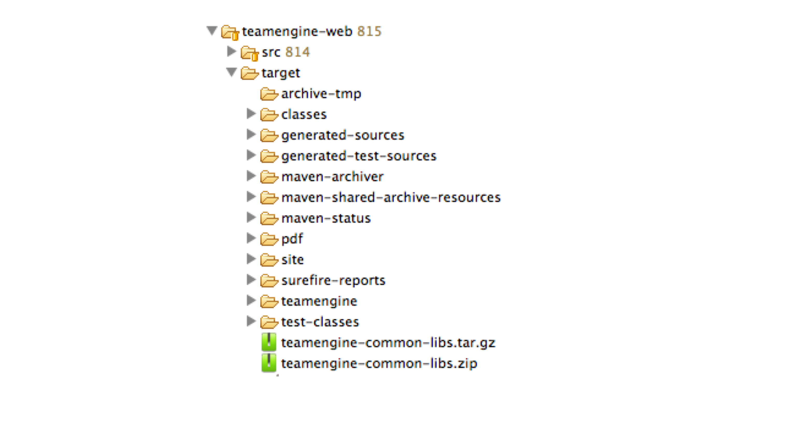

Copy the war file under webapps in tomcat.

.. image:: ../img/tomcat-tewar.jpg
     :width: 10in   
     
Install Realm
=============

Under the folder ``teamengine-realm/target`` a jar file was created. This jar manages a simple authentication and
management of users using TEAM Engine. Copy this file under ``lib`` in the web server.

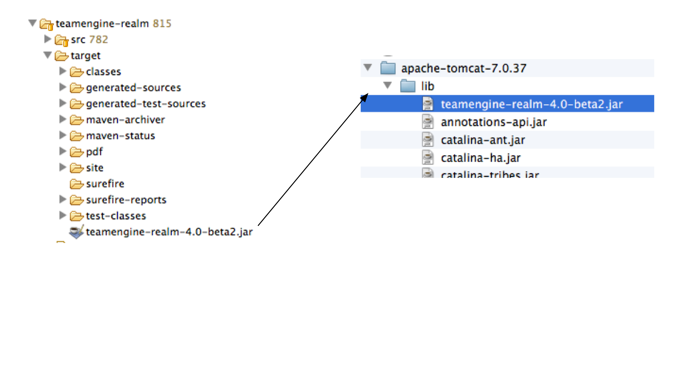

Configure Tomcat
================

Open bin/startup.sh (or startup.bat if running in windows). And before PRGDIR=`dirname "$PRG"` add the following two first lines::

   # define CATALINA_OPTS for TEAM Engine
   export CATALINA_OPTS="-server -Xmx1024m -XX:MaxPermSize=128m -DTE_BASE=$TE_BASE -Dderby.system.home=$DERBY_DATA"

   PRGDIR=`dirname "$PRG"`
   EXECUTABLE=catalina.sh
   
   
Configure TE_BASE scripts
=========================
Register the tests that will appear in the web interface in ``TE_BASE/config.xml``. For example add the following inside <stripts></scripts>::

    <organization>
     <name>OGC</name>
     <standard>
       <name>OGC KML</name>
       <version>
         <name>2.2</name>
         <suite>
           <namespace-uri>http://www.opengis.net/cite/kml22</namespace-uri>
           <prefix>tns</prefix>
           <local-name>ets-kml22-2.2-r1</local-name>
           <title>KML 2.2 Validator</title>
           <description>Verifies the structure and content of KML 2.2 documents.</description>
         </suite>
         <revision>
           <name>2.2-r1</name>
           <status>Alpha</status>
           <sources>
             <source>kml22/2.2-r1/kml22-suite.ctl</source>
           </sources>
           <webdir>kml22/2.2-r1/web</webdir>
         </revision>
       </version>
     </standard>
   </organization>

Add the test libraries
======================

For TestNG tests copy the test jars under lib.

Start Tomcat
============

For example::

   $ cd /Applications/apache-tomcat-7.0.37
   $ cd bin
   $ ./startup.sh
   

When typing: http://localhost:8080/teamengine/

The TEAM Engine Web Inerface should appear like the following:

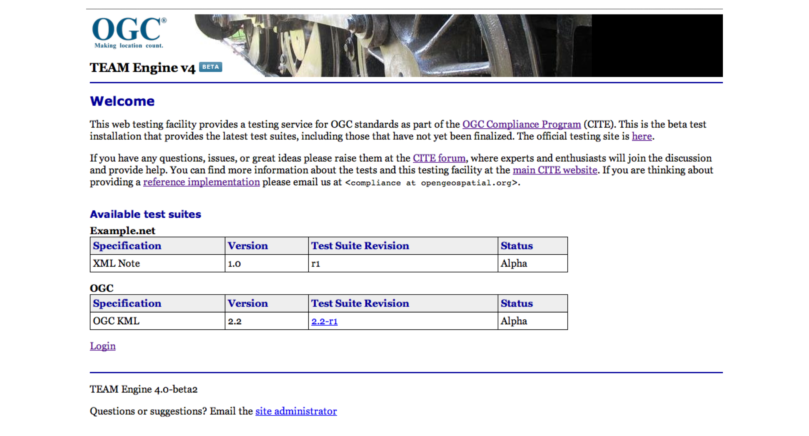
     
     
Building for Tomcat 6
=====================

The TEAM Engine application can work in Tomcat 6 by mapping the aliases to contexts::

      $ cd $CATALINA_HOME # Tomcat instance for teamengine
      $ echo '<Context docBase="${TE_BASE}/resources/docs"></Context>'
       > ./conf/Catalina/localhost/teamengine#docs.xml
      $ echo '<Context docBase="${TE_BASE}/scripts"></Context>'
       > ./conf/Catalina/localhost/teamengine#about.xml
      $ echo '<Context docBase="${TE_BASE}/users"></Context>'
       > ./conf/Catalina/localhost/teamengine#reports.xml
      $ echo '<Context docBase="${TE_BASE}/resources/site"></Context>'
       > ./conf/Catalina/localhost/teamengine#site.xml

      
   