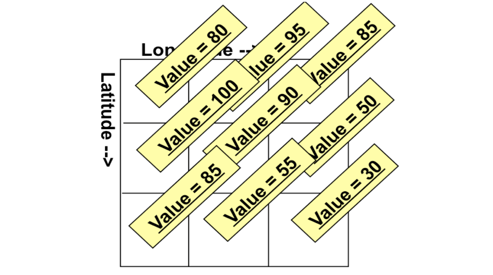
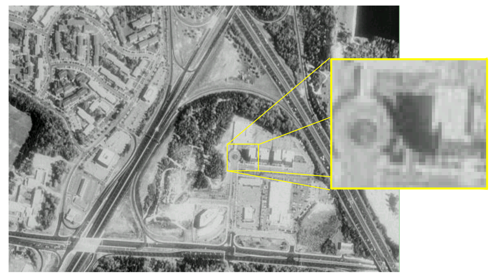
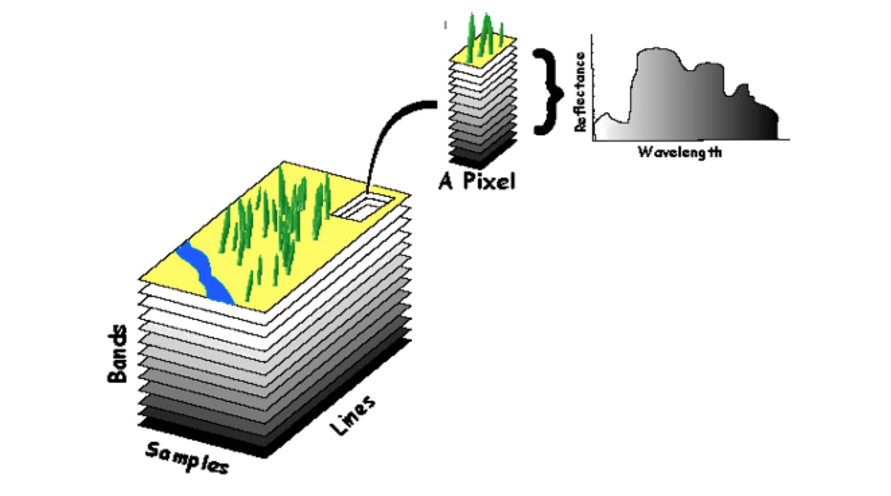

Web Coverage Service (WCS)
==========================

Coverage
--------

Definition:
   space/time-varying phenomena  that relate a spatio-temporal domain to a (possibly multidimensional) range of properties

Domain:
   grids; polygons, points, etc.

Range components:
   vector- or scalar-valued

Coverage
--------

Examples:

- Raster image
- Polygon overlay
- Digital elevation matrix

Coverage
--------

      

      

Visible Brightness
------------------

      
Land use / Land Cover
---------------------

.. image:: ../img/landuse.jpg
      :height: 800
      :width: 1200 
      
Multi Spectral Imagery
----------------------

      

Triangulated Irregular Network (TIN)
------------------------------------

.. image:: ../img/tin.jpg
      :height: 800
      :width: 1200 
      
.. A TIN is a vector-based representation of the physical land surface or sea bottom, made up of irregularly distributed nodes and lines with three-dimensional coordinates (x, y, and z) that are arranged in a network of nonoverlapping triangles. TINs are often derived from the elevation data of a rasterized digital elevation model (DEM). An advantage of using a TIN over a raster DEM in mapping and analysis is that the points of a TIN are distributed variably based on an algorithm that determines which points are most necessary to an accurate representation of the terrain. Data input is therefore flexible and fewer points need to be stored than in a raster DEM, with regularly distributed points. A TIN may be less suited than a raster DEM for certain kinds of GIS applications, such as analysis of a surface's slope and aspect. 
   

WCS Operations
--------------

- **GetCapabilities**: delivers an XML-encoded description of service properties and the data holdings offered by the server inquired;
- **DescribeCoverage**: delivers XML-encoded descriptions of coverages (such as their location in space and time);
- **GetCoverage**: delivers a coverage (or part thereof), either as original data or processed, in some suitable data format.

WCS Protocol Extensions
-----------------------

WCS requests and responses can make use of one of the following protocols:

   - GET/KVP: using the HTTP GET protocol for sending key-value-pair (KVP) encoded requests and receiving XML metadata and binary coverage data
   - POST/XML: using the HTTP POST protocol for transferring XML data and binary coverage data
   - SOAP/XML: using the SOAP protocol for transferring XML data and binary coverage data

WCS format extensions
---------------------
WCS format encodings allow to deliver coverages in various data format:

- GML
- GeoTIFF
- HDF-EOS
- NITF

.. GeoTIFF is a public domain metadata standard which allows georeferencing information to be embedded within a TIFF file. The potential additional information includes map projection, coordinate systems, ellipsoids, datums, and everything else necessary to establish the exact spatial reference for the file. The GeoTIFF format is fully compliant with TIFF 6.0, so software incapable of reading and interpreting the specialized metadata will still be able to open a GeoTIFF format file

.. TIFF (originally standing for Tagged Image File Format) is a file format for storing images, popular among graphic artists, the publishing industry,[1] and both amateur and professional photographers in general. As of 2009, it is under the control of Adobe Systems. Originally created by the company Aldus[2] for use with "desktop publishing", the TIFF format is widely supported by image-manipulation applications, by publishing and page layout applications, and by scanning, faxing, word processing, optical character recognition and other applications

.. The National Imagery Transmission Format Standard (NITFS) is a U.S. Department of Defense (DoD) and Federal Intelligence Community (IC) suite of standards for the exchange, storage, and transmission of digital-imagery products and image-related products.

Examplar Implementations for Imagery
------------------------------------

ESA Heterogeneous Missions Accessibility (HMA)
   WCS Application Profile for Earth Observation

Spot Image
   WCS for the International Charter on Space and Major Disasters.

Geoeye Geofuse
   Imagery holdings with less than 20% cloud cover

Intermap NEXTMap
   1-meter vertically accurate digital elevation models and geometric images

Latest Version
--------------
Title
   OGC® WCS 2.0 Interface Standard- Core: Corrigendum
Version
   2.0.1
Document Number
   09-110r4
URL
   http://www.opengeospatial.org/standards/wcs

Exercise
--------

Server:
   EOxServer ESA
URL for Demo Details
   http://ows.eox.at

Exercise
--------

1. Explore get Capabilities
2. Invoke the GetCoverage
3. Invoke DescribeCoverage

WCS Get Capabilities
--------------------

Request example::

   http://ows.eox.at/cite-wcs?
   service=wcs&
   version=2.0.0&
   request=getcapabilities

`Link <http://ows.eox.at/cite-wcs?service=wcs&version=2.0.0&request=getcapabilities>`_

WCS Describe Coverage
---------------------

Request example::

   http://ows.eox.at/cite/ows?
   service=wcs&
   version=2.0.0&
   request=describecoverage&
   coverageid=MER_FRS_1PNUPA20090701_124435_
      000005122080_00224_38354_6861_RGB

`Link <http://ows.eox.at/cite/ows?service=wcs&version=2.0.0&request=describecoverage&coverageid=MER_FRS_1PNUPA20090701_124435_000005122080_00224_38354_6861_RGB>`_

WCS GetCoverage
---------------

Request example::

   http://ows.eox.at/cite-wcs?service=wcs&
   version=2.0.0&
   request=getcoverage&
   CoverageID=MER_FRS_1PNUPA20090701_
     124435_000005122080_00224_38354_6861_RGB

`Link <http://ows.eox.at/cite-wcs?service=wcs&version=2.0.0&request=getcoverage&CoverageID=MER_FRS_1PNUPA20090701_124435_000005122080_00224_38354_6861_RGB>`_

