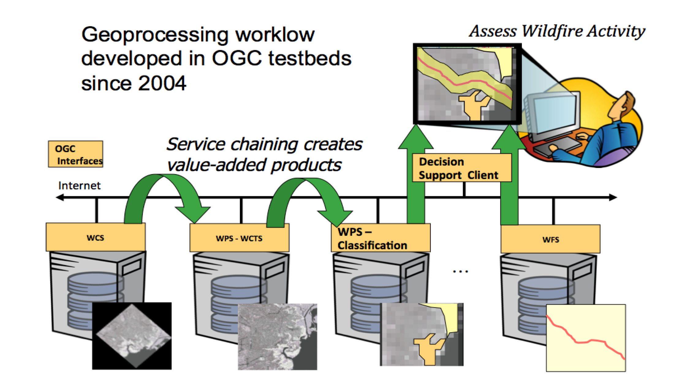

Web Processing Service (WPS)
============================

This tutorial provides an introduction to the  OGC Web processing Service (WPS) Interface Standard.

Geoprocessing
-------------

A GIS operation used to manipulate GIS data.

Examples?

Data Processing
---------------

.. image:: ../img/geoprocessing.jpg
      :height: 800
      :width: 1200  
      
Types of Operations
-------------------
- Feature Overlay
- Feature Selection
- Topology processing
- Raster processing
- Data Conversion
- Feature Analysis

Web Processing Service
----------------------
.. image:: ../img/wps.jpg
      :height: 800
      :width: 1200  
      
      
Classification
--------------
.. image:: ../img/classification.jpg
      :height: 800
      :width: 1200  
      
      
Model Run
---------
.. image:: ../img/modelrunning.jpg
      :height: 654
      :width: 1049  
      
      
Workflows
---------
.. image:: ../img/workflows.jpg
      :height: 800
      :width: 1200  
      
Service Chaining
----------------

.. Web-based geospatial service chaining and decision support. How do we reliably and repeatedly combine results from several distributed services on the web to produce a result for a user? Service chaining is the term commonly used for the process of organizing disparate web based services into an orderly process. For instance, a raw image is sent to a service that performs a coordinate transformation. This services sends the transformed image to a classifier service that processes the image to highlight areas of active fire. The result of this service is sent to a user’s client along with other geospatial data such as vegetation overlays, transportation. Service chaining will play an important role in future capabilities.

      
      
Reusability
-----------
.. image:: ../img/reusability.jpg
      :height: 800
      :width: 1200  
      
Operations
----------
GetCapabilities
   returns information about the service
DescribeProcess
   returns details of a specific process including its inputs and outputs
Execute
   returns, for a specific process, the output(s) of a process

Parameters DescribeProcess
--------------------------
- service
- request
- describeProcess
- identifier

Input
-----
- URL
- GML
- Image
- Data

Output
------
- URL
- GML
- Image
- Another service

Open Layers Demo
----------------
http://openlayers.org/dev/examples/wps.html

- inspect process types
- run a buffer operation

52North Demo
------------
http://geoprocessing.demo.52north.org:8080/wps/test.html

- run the default buffer operation
- what can I input to the process?

52North Demo
------------
Use another feature collection as input.

For example `this getFeature request <http://demo.opengeo.org/geoserver/og/ows?service=WFS&amp;version=1.0.0&amp;request=GetFeature&amp;typeName=og%3Astreams&amp;maxfeatures=1&outputformat=GML3>`_

